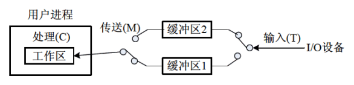
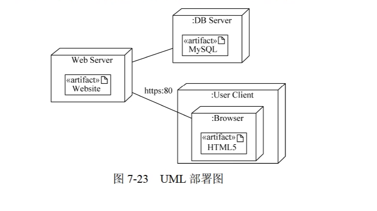
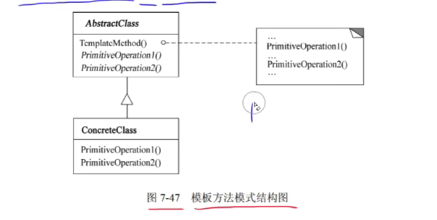
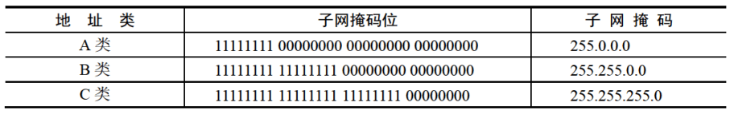

> 前言：恭喜你发现了宝藏up主zst。首先我在这里非常感谢up的精心制作的教程，无私奉献出来，让我们都能免费学习，而且up主提供的资料都非常丰富，个人感觉应对软件设计师这个考试应该问题不大。其次我在学习up主的视频时候顺便潦草的在被人笔记的基础上修修改改，增增添添成为了现在这个笔记。但是我感觉我做的过于冗余了，应该称之为zst的讲义，希望大家可以自己甄别取其精华，弃其糟粕。最后，我想说zst真的大好人，他说不要再说我的课免费免费，你花时间看我的课，我把你的时间收走了，这难道不是最宝贵的东西吗？我想大家看到zst的课，觉得不错了，投个币也是对zst的一种肯定吧！！！
>
> 作者：xzy
>
> 时间：2023年11月5日

# 基础知识

## 第一章 计算机系统
### 计算机系统基础知识

#### 计算机系统硬件基本组成

计算机的基本硬件系统由**运算器、控制器、存储器、输入设备、输出设备**的5大部件组成。

#### 中央处理单元

中央处理单元（CPU）是计算机系统的核心部件，它负责获取程序指令、对指令进行译码并加以执行。

##### 1. CPU的功能

- 程序控制（控制器）
- 操作控制（控制器）
- 时间控制（控制器）
- 数据处理（运算器）

##### 2. CPU的组成

**CPU主要由运算器、控制器、寄存器组和内部总线等部件组成。**

1. 运算器：运算器只能完成运算。
   - 算术逻辑单元（ALU）:负责处理数据，实现对数据的算数运算和逻辑运算
   - 累加寄存器（AC）：运算器的算数逻辑单元执行算数或逻辑运算时，为ALU提供一个工作区，运算的结果存储在AC中。
   - 数据缓冲寄存器（DR）：作为CPU和内存、外部设备之间的中转站。
   - 状态条件寄存器（PSW）：保存各种条形码内容。

2. 控制器：控制器用于控制整个 CPU 的工作，它决定了计算机运行过程的自动化。**它不仅要保证程序的正确执行，而且要能够处理异常事件**。
   - 指令寄存器（IR）：当CPU执行指令时，先把它从内存存储器取到缓冲寄存器中，在送入IR暂存。对用户完全透明
   - **程序计数器（指令计数器）（PC）**：跟踪指令的地址。PC在顺序执行的时候加1，在转移执行的时候加上一个位移量
   - 地址寄存器（AR）：保存当前CPU所访问的内存单元的地址
   - 指令译码器（ID）：指令包含操作码和地址码。对指令中的操作码进行分析解释

**补充：指令 == 操作码 + 地址码**

3. 课外知识 

   

#### 计算机基本单位

| 位（比特） 最小数据单位 | **bit、b** |    8b=1B     |
| :---------------------: | :--------: | :----------: |
|    字节 最小存储单位    |  byte、B   |   1B = 8b    |
|         千字节          |     KB     | 1KB = 1024B  |
|         兆字节          |     MB     | 1MB = 1024KB |
|         吉字节          |     GB     | 1GB = 1024MB |
|         太字节          |     TB     | 1TB = 1024GB |

#### 数据表示

|   进制   | 英文简写 |
| :------: | :------: |
|  二进制  |    B     |
|  八进制  |    O     |
|  十进制  |    D     |
| 十六进制 |    H     |

- **按权展开求和**：n进制   ————> 十进制　　每一位八进制数与三位二进制数对应

- **除n取余法**：十进制   ————> n进制　　     每一位十六进制数与四位二进制数对应
- **进制加减法**：加法：逢n进制进一				      减法：借一当n
- **原码**：总共有n位。最高位是符号位，0表示正号，1表示负号。其余n - 1为位表示数值的绝对值。
- **反码**：正数的反码与原码相同，负数的反码则是其绝对值按位求反。
- **补码**：正数的补码与其原码和反码相同，负数的补码则是等于其反码的末位加1。补码可以简化计算机运算部件的设计
- **移码**：在补码的基础上取反符号位。
- 补充
  - 正数的原码补码和反码都相同
  - 补码再取补码等于源码
  - ±0的补码、移码相同

#### 各种码制带符号数的范围


#### 浮点数

浮点数使用两个定点数来分别表示实数的尾数（F）和阶码（E）。其一般形式为：N = 2^E * F

- 阶码为带符号的纯整数，尾数为带符号的纯小数。

- 一个数的浮点表示不是唯一的。小数点位置改变，阶码也随着相应改变。

- 浮点数所能表示的数值范围主要由阶码决定，所表示数值的精度则由尾数决定。

- 阶数不一样，先对阶小阶向大阶对，浮点数右移

- 规格化就是将尾数的绝对值限定在区间[0.5,1]

- 一般浮点数阶码用R位的移码表示，尾数用M位的补码表示。这种表示的数值范围为：


#### 寻址

- **立即寻址**：操作数就包含在指令中。（最快）
- **寄存器寻址**：操作数存放在某一寄存器中，指令中给出存放操作数的寄存器名。
- **直接寻址**：操作数存放在内存单元中，指令中直接给出操作数所在存储单元的地址。
- **寄存器间接寻址**：操作数存放在内存单元中，操作数所在存储单元的地址在某个寄存器中。
- **间接寻址**：指令中给出操作数地址的地址。（最慢）
- 相对寻址：指令地址码给出的是一个偏移量（可正可负)，操作数地址等于本条指令的地址加上该偏移量。
- 变址寻址：操作数地址等于变址寄存器的内容加偏移量。
- 补充
  - 指令系统中采用不同的寻址方式的目的是：扩大寻址空间并提高编程灵活性
#### 校验码

1. 奇偶校验码
   
   > **作用**：用于检测数据传输或存储过程中的**单个比特错误**（1位错误）。
   > **原理**：在数据位后添加一个校验位，使整个数据（包括校验位）中“1”的个数为**奇数（奇校验）或偶数（偶校验）**。

   1. 只能检错，不能纠错，码距 = 2。
   2. 只能检测出奇数个数据位出错，不能检测偶数个数据位出错
   3. 水平奇偶校验码、垂直奇偶校验码、水平垂直奇偶校验码。
   
2. 海明码
   - 海明码可以检错也可以纠错。
   - 码距 = 2 ，检错能力     码距 >= 3，才有可能有纠错能力
   - 数据位是n，校验位是k，则n和k必须满足一下关系： **2^*k* − 1≥ *n*+k**

3. 循环冗余校验码（CRC）
   - 可以检错，但不能纠错,码距 = 2。
   - k个数据位后跟r个校验位
   - 校验位r采用模2运算


### 计算机体系结构

#### CISC 和 RISC
|  | RISC精简指令集计算机 | CISC复杂指令集计算机 |
| :-: | :-: | :-: |
| 指令种类 | 少、精简 | 多、丰富 |
| 指令复杂度 | 低（简单） | 高（复杂） |
| 指令长度 | 固定 | 变化 |
| 寻址方式 | 少 | 复杂多样 |
| 实现（译码）方式 | 硬布线控制逻辑（组合逻辑控制器） | 微程序控制技术 |
| 通用寄存器数量 | 多、大量 | 一般 |
| 流水线技术 | 支持 | 支持 |

#### 流水线

计算机中的流水线技术是把一个重复的过程分解为若干个子过程，每个子过程与其他子过程并行进行。

若要执行n条指令：

- 顺序执行总时间：顺序执行总时间  =  单条指令执行的时间  ×  n

- 流水线执行总时间：

  - 流水线执行总时间  =  一条指令执行的时间  +  流水线周期  ×   (*n*−1)
  - 流水线（操作）周期为执行时间最长的一段操作的时间。

- 连续输入*n*条指令的吞吐率：

  - 吞吐率  =  n  ÷  总执行时间
  - 如果是流水线的吞吐率，则总执行时间为流水线执行总时间。 **流水线的吞吐率是最长流水段操作时间的倒数**。即：最长流水段操作时间  =  流水线执行总时间  ÷  n

- 加速比：

  加速比  =  顺序执行总时间 ÷ 流水线执行总时间

#### 存储系统

1. SRAM（静态随机存储器）：构成Cache（缓存）
2. DRAM（动态随机存储器）：构成主存 DRAM需要周期性地刷新保持信息。
3. RAM（读/写存储器）
4. ROM（只读存储器）
5. PROM（可编程的只读存储器）

- 按存储器所处位置可分为：

  - 内存（主存）：在主机内或主板上，存放机器当前运行所需的程序和数据，以便向CPU提供信息。（相对外存）容量小、速度快。

  - 外存（辅存）：存放当前不参加运行的大量信息，在需要时调入内存。

- 按存储器的构成材料分类：

  - 磁存储器

  - 半导体存储器

  - 光存储器

- 按存储器工作方式：

  - 读/写存储器（RAM）。

  - 只读存储器：ROM、PROM、EPROM、EEPROM等。
    - 固定只读存储器（ROM）：厂家生产时就写好数据在其中。只能读（用户）不能写。一般用于存放BIOS和微程序控制。
    - 可编程读只读存储器（PROM）：其内容可以由用户一次性地写入，写入后不能再修改。
    - EPROM、EEPROM是指带电可擦可编程只读存储器。

- 按访问方式：

  - 按地址访问：
    - 随机存储器（RAM）
    - 顺序存储器（SAM）
    - 直接存储器（DAM）

  - 按内容访问：例如相联存储器。

- 高速缓存（Cache）用来存放当前最活跃的程序和数据，其特点是：

  - 位于CPU与主存之间；容量一般在几千字节到几兆字节之间；

  - 速度一般比主存快5~10倍，由快速半导体存储器构成；

  - 其内容是主存局部域的副本，**对程序员来说是透明的。**

Cache存储器部分用来存放主存的部分拷贝（副本）信息。控制部分的功能是判断CPU要访问的信息是否在Cache存储器中，若在即为命中，若不在则没有命中。命中时直接对Cache存储器寻址；未命中时，要按照替换原则决定主存的一块信息放到Cache存储器的哪一块里。

- 补充内容
  - 虚拟存储器由主存与辅存组成。
  - 闪存（flsah）类似U盘，掉电后信息不会丢失。以块为单位进行删除。闪存是EPROM的一种类型，可以代替ROM存储器。闪存不可以代替主存。
  - **Cache 与主存地址的映射是由硬件自动完成的**
  - 数据总线：**数地控**即数据总线、地址总线和控制总线
  - 发生块冲突从多到少的顺序：直接映像 > 组相联映像 > 全相联映像。

#### 中断

计算机在执行程序过程中，当遇到急需处理的事件时，暂停当前正在运行的程序，转去执行有关服务程序，处理完后自动返回源程序，这个过程称为中断。

- 中断向量：提供中断服务程序的入口地址
- 中断响应时间：发出中断请求开始，到进入中断服务程序
- 保存现场：返回执行源程序
- 多级中断使用堆栈来保护现场最有效

#### 输入输出(I/O)控制方式

1. 程序查询方式

   - **CPU和 I/O（外设）只能串行工作** ，CPU需要一直轮询检查，长期处于忙等状态。CPU 利用率低 
   
   
      - 一次只能读/写一个字
   
   
      - 由 CPU 将数放入内存
   
           ​								　　　　
   


2. 中断驱动方式

   - I/O 设备通过中断信号主动向 CPU 报告 I/O 操作已完成
   
   
      - **CPU 和 I/O（外设）可并行工作** 
   
   
      - CPU 利用率得到提升
   
   
      - 一次只能 读/写 一个字
   
   
      - 由 CPU 将数据放入内存											
   
3. 直接存储器方式（DMA）

   -  CPU 和 I/O（外设）可并行工作 

   -  仅在传送数据块的开始和结束时才需要 CPU 的干预 

   -  由外设直接将数据放入内存 

   -  一次读写的单位为”块“而不是字										


#### 总线

总线是连接计算机有关部件的一组信号线，是计算机中用来传送信息代码的公共通道。

采用总线结构主要有以下优点：

- 简化系统结构，便于系统设计制造；
- 大大减少了连线数目，便于布线，减小体积，提高系统的可靠性；
- 便于接口设计，所有与总线连接的设备均采用类似的接口；
- 便于系统的扩充、更新与灵活配置，易于实现系统的模块化；
- 便于设备的软件设计；
- 便于故障诊断和维修，同时也降低了成本。

在计算机系统中采用总线结构，便于实现系统的积木化构造，同时可以减少信息传输线的数量。

微机中的总线分为：

- 数据总线
- 地址总线
- 控制总线

常见总线：

- ISA总线。
- EISA总线。
- PCI总线：PCI总线是目前微型机上广泛采用的**并行内总线。**
- PCI Express 总线。
- 前端总线。
- RS-232C。
- SCSI总线：小型计算机系统接口（SCSI）是一条**并行外总线**。
- SATA。
- USB。
- IEEE-1394。
- IEEE-488总线。

#### 加密技术和认证技术

-  加密技术： 
   1.  对称加密（私有密钥加密）
   加密和解密是同一把密钥，只有一把密钥
   密钥分发有缺陷     1. 加密解密速度很快 	2. 适合加密大量明文数据 
   2.  非对称密钥（公开密钥加密）
   加密和解密不是同一把密钥，一共有两把密钥 分别是公钥和私钥
   用公钥加密只能用私钥解密	用私钥加密只能用公钥解密
   不能通过一把推出另一把 	用接收方的公钥加密明文，可以实现防止窃听的效果
   密钥分发没有缺陷	1.加密解密速度很慢 
   3.  混合加密 
-  认证技术： 
   1.  摘要：将发送的明文进行Hash算法后得到的摘要放在密文后一起发送过去，与接收方解密后的明文进行相同的Hash算法得到的摘要进行对比，如果一致，则没有篡改，否则有篡改。 
   2.  数字签名：发送方用自己的私钥对摘要进行签名（加密）得到数字签名放在密文后一起发送过去。接收方用发送方的公钥对数字签名进行验证（解密）如果验证成功则该消息没有被假冒且不能否认，否则该消息的真实性为假冒发送。 
     - 使用数字签名确保消息不可否认
   3.  数字证书：用户向CA（权威机构）机构申请数字证书，将个人信息和公钥发给CA机构，CA机构颁给用户数字证书，数字证书用CA的私钥进行签名（加密）用CA的公钥验证（解密）数字证书得到用户的公钥。
       - 使用数字整数确保用户身份
       - 用户通过CA的公钥验证CA的签名，确定网站的真伪 

#### 加密算法

| 对称密钥（私钥、私有密钥加密）算法（共享密钥加密算法） | 非对称密钥（公钥、公开密钥加密）算法 |
| :-: | :-: |
| DES | RSA |
| 3DES | ECC |
| RC-5 | DSA |
| IDEA |  |
| AES |  |
| RC4 |  |


Hash函数

MD5 摘要算法（128位散列值）

SHA-1 安全散列算法

**认证是处理主动攻击**

#### 可靠性

1. 串联系统。假设一个系统由N个子系统组成，当且仅当所有子系统都能正常工作时系统才能正常工作，这样的系统称为串联系统。
   - 
   - 系统可靠性  R = R₁R₂···Rn

2. 并联系统。假设一个系统由N个子系统组成，只要有一个子系统正常工作，系统就能正常工作，这样的系统称为并联系统。
   1. 
   2. 系统可靠性  R = 1 -  (1-R₁)(1-R₂)···(1-Rn)

### 补充列题说明

- 指令寄存器的位数取决于**<u>指令字长</u>**
- 逻辑同或：**相同为一，不同为零**
- 逻辑异或：**相同为零，不同为一**
- 计算机采用分层存储体系的主要目的是为了解决：**<u>存储容量、成本和速度之间的矛盾</u>**
- 被动攻击：流量分析、会话拦截。                       主动攻击：重放、IP地址欺骗、拒绝服务、系统干涉、修改数据命令
- CPU依据 <u>**指令周期的不同阶段**</u>来区分内存中以二进制编码形式存放的指令和数据

|  X   |  Y   | 逻辑与 | 逻辑或 | 逻辑异或 | 逻辑同或 |
| :--: | :--: | :----: | :----: | :------: | :------: |
|  0   |  0   |   0    |   0    |    0     |    1     |
|  0   |  1   |   0    |   1    |    1     |    0     |
|  1   |  0   |   0    |   1    |    1     |    0     |
|  1   |  1   |   1    |   1    |    0     |    1     |

## 第二章 程序设计语言

### 程序设计语言的基本概念

- 解释器：翻译源程序时不生产独立的目标程序。

  - 解释程序和源程序要参与到程序的运行过程中。

- 编译器：翻译时将源程序翻译成独立保存的目标程序。

  - 机器上运行的是与源程序等价的目标程序，源程序和编译程序都不再参与目标程序的运行过程。

- 许多程序设计语言规定，程序中的数据必须具有类型，其作用是：

  - 便于为数据合理分配存储单元

  - 便于对参与表达式计算的数据对象进行检查

  - 便于规定数据对象的取值范围及能够进行的运算


### 程序设计语言的基本成分

#### 函数定义

函数的定义包括两部分：函数首部和函数体。函数的定义描述了函数做什么和怎么做。

函数定义的一般形式为：

> 返回值的类型	函数名(形式参数表)	//函数首部	函数名(实参表)；
>
> {
>
> ​	函数体；
>
> }

(1)值调用。若实现函数调用时将实参的值传递给相应的形参， 则称为是传值调用。在这种方式下形参不能向实参传递信息。

(2)引用调用。引用是 C++ 中引入的概念，当形式参数为引用类型时，形参名实际上是实参的别名，函数中对形参的访问和修改实际上就是针对相应实参所做的访问和改变。

- 传值调用：

  - 将实参的值传递给形参，实参可以是变量、常量和表达式。


  - 不可以实现形参和实参间双向传递数据的效果。


- 传引用（地址）调用：

  - 将实参的地址传递给形参，形参必须有地址，实参不能是常量（值），表达式。可以实现形参和实参间双向传递数据的效果，即改变形参的值同时也改变了实参的值。


### 编译程序基本原理

- 编译方式：词法分析、语法分析、语义分析、中间代码生成、代码优化、目标代码生成
- 解释方式：词法分析、语法分析、语义分析

- 编译器和解释器都不可省略词法分析、语法分析、语义分析且顺序不可交换
- 即词法分析、语法分析、语义分析是必须的。

- 编译器方式中中间代码生成和代码优化不是必要，可省略。
- 即编译器方式可以在词法分析、语法分析、语义分析阶段后直接生成目标代码

​																	

**符号表**：不断收集、记录和使用源程序中一些相关符号的类型和特征等信息，并将其存入符号表中。记录源程序中各个字符的必要信息，以辅助语义的正确性检查和代码生成。

1）词法分析

输入：源程序

输出：记号流

词法分析阶段的主要作用是：分析构成程序的**字符及由字符按照构造规则构成的符号，是否符合程序语言的规定**。

2）语法分析

输入：记号流

输出：语法树（分析树）

语法分析阶段的主要作用是：对各条**语句的结构进行合法性分析**，分析程序中的句子结构是否正确。

3）语义分析

输入：语法树（分析树）

语义分析阶段的主要作用是进行**类型分析和检查**

语义分析阶段可以发现程序中**所有的语法错误**

**语义分析阶段不能发现程序中所有的语义错误**

语义分析阶段可以**发现静态语义错误**，不能发现动态语义错误，动态语义错误运行时才能发现（eg：除数为0时只能在运行阶段检查出来）

4）中间代码生成

常见的中间代码有：后缀式、三地址码、三元式、四元式和树（图）等形式。

**中间代码与具体的机器无关**（不依赖具体的机器）,可以将不同的高级程序语言翻译成同一种中间代码。

中间代码可以跨平台。

因为与具体的机器无关，使用中间代码有利于进行与机器无关的优化处理和提高编译程序的可移植性。

6）目标代码生成

目标代码生成阶段的工作与具体的机器密切相关

寄存器的分配工作处于目标代码生成阶段

### 正规式


###有限自动机

- **有限自动机是词法分析**的一个工具，它能正确地识别正规集
- 确定的有限自动机（ DFA )：对每一个状态来说识别字符后转移的状态是唯一的
- 不确定的有限自动机（ NFA )：对每一个状态来说识别字符后转移的状态是不唯一的

### 上下文无关文法

- 程序设计语言的绝大多数**语法规则**可以采用**上下文无关文法**进行描述。

- 上下文无关文法属于乔姆斯基定义的2型文法。

### 中缀后缀表达式

中缀式：a  ？ b	   ===>	后缀式：ab？ 		后缀式转中缀式可以用：栈

中间代码有多种形式，其中树与后缀表示形式适用于解释器，而编译器多采用与机器指令格式较接近的四元式形式。

根据生成的语法树，按照不同的方式遍历即可生成形式不同的表达式：

- 中缀表达式：中序遍历（左-根-右）；
- 后缀表达式：后序便利（左-右-根）。

> 逆波兰式其实就是后缀式。

## 第三章 数据结构

这章我没怎么看，大家自己补充一下

## 第四章 操作系统

### 概述

计算机系统由两部分组成：

- **硬件**
- **软件**

通常把未配置软件的计算机称为裸机。

操作系统目的是：为了填补人与机器之间的鸿沟，即建立用户与计算机之间的接口，而为裸机配置的一种系统软件。

操作系统也包括了系统软件。

操作系统在计算机系统中的地位：


操作系统是用户与计算机之间的接口，它在计算机系统中占据重要而特殊的地位，所有其他软件，如编辑程序、汇编程序、编译程序、数据库管理系统等系统软件，以及大量的应用软件都是建立在操作系统基础上的，并得到它的支持和取得它的服务。

### 程序与进程
程序顺序执行时的主要特征包括：顺序性、封闭性和可再现性。

程序并发执行时的主要特征包括：失去了程序的封闭性、程序和机器的执行程序的活动不再一一对应、并发程序之间的相互制约性。

### 三态模型
在多道程序系统中，进程在处理器上交替运行，状态也不断地发生变化，因此进程一般有3种基本状态：运行、就绪和阻塞。

- **运行**：当一个进程在处理机上运行时。
- **就绪**：一个进程获得了除处理机外的一切所需资源，一旦得到处理机即可运行（还未得到）。
- **阻塞**（等待或睡眠）：一个进程正在等待某一事件发生而暂时停止运行，这时即使把处理机分配给进程也无法运行。


| 进程 | CPU | 资源 |
| :-: | :-: | :-: |
| 运行 | √ | √ |
| 就绪 | × | √ |
| 阻塞 | × | × |

### 进程间的通信

在多道程序环境的系统中存在多个可以并发执行的进程，故进程间必然存在资源共享和相互合作的问题。进程通信是指各个进程交换信息的过程。

#### 同步和互斥

- **同步**：合作进程间的直接制约问题。

  进程间的同步：是指在系统中一些需要相互合作，协同工作的进程，这样的相互联系称为进程的同步。

  例如，进程A向缓冲区送数据，进程B从缓冲区取数据加工，当进程B要取数据加工时，必须是进程A完成了向缓冲区送数据的操作，否则进程B必须停下来等待进程A的操作结束。

- **互斥**：申请临界资源进程间的间接制约问题。

  进程间的互斥：是指系统中多个进程因争用临界资源而互斥执行。

  > 临界资源：在多道程序系统环境中，那些一次只能供一个进程使用的资源。如打印机、共享变量和表格等。

临界区管理的原则：

> 临界区：是进程中对临界资源实施操作的那段程序。

对互斥临界区管理的4条原则如下：

- **有空即进**：当无进程处于临界区时，允许进程进入临界区，并且只能在临界区运行有限 的时间。
- **无空则等**：当有一个进程在临界区时，其他欲进入临界区的进程必须等待，以保证进程互斥地访问临界资源。
- **有限等待**：对于要求访问临界资源的进程，应保证进程能在有限的时间进入临界区，以免陷入“**饥饿**”状态。
- **让权等待**：当进程不能进入自己的临界区时，应立即释放处理机，以免进程陷入**忙等**状态

#### 信号量机制

信号量机制是一种有效的进程同步与互斥工具。

信号量机制主要有：

- 整型信号量
- 记录型信号量
- 信号量集机制

整型信号量：

信号量是一个整型变量，根据控制对象的不同被赋予不同的值。信号量分为如下两类：

- 公用信号量：实现进程间的互斥，初值为`1`或资源的数目。
- 私用信号量：实现进程间的同步，初值为`0`或某个正整数。

信号量 S 的物理意义：

- S ≥ 0：表示某资源的可用数，此时**有可用资源**；
- S＜0：则其绝对值表示阻塞队列中等待该资源的进程数，此时无可用资源，并且有进程被阻塞。

#### PV操作

PV操作：实现**进程同步与互斥**的常用方法。

P操作和V操作是低级通信原语，在执行期间不可分割。其中：

- **P操作**（减）：表示**申请**一个资源；

  定义：S := S−1（S表示信号量）

  - S ≥ 0：执行P操作的进程继续执行；
  - S＜0：无可用资源，置该进程为**阻塞**状态，并将其插入阻塞队列。

- **V操作**（加）：表示**释放**一个资源。

  定义：S := S+1

  - S ≥ 0：执行V操作的进程继续执行；
  - S＜0：表示释放前有程序被阻塞，从阻塞状态唤醒一个进程，并将其插入就绪队列，然后执行V操作的进程继续。

> P减V加，P进V出。

**利用PV操作实现进程的互斥：**

1. 令信号量`mutex`的初始值为1；
2. 进入临界区：执行P操作；
3. 推出临界区：执行V操作。

**利用PV操作实现进程的同步：**

实现进程的同步可用一个信号量与消息联系起来。

信号量的值：

- 为`0`：表示希望的消息未产生；
- 非`0`：表示希望的消息已经存在。

假定信号量S表示某条消息，进程可以：

- 调用P操作：测试消息是否到达；
- 调用V操作：通知消息已经准备好。

#### 死锁

当有 n 个进程，m个资源，且每个进程所需要的资源数为k，并且系统采用的分配策略是轮流地为每个进程分配资源时，判断是否发生死锁的公式如下：
$$
m >= n * (k-1)+1
$$
死锁的处理策略主要有4种：鸵鸟策略（即不理睬策略）、预防策略、**避免策略**和检测与解除死锁。

#### 进程资源图

做题方法：先分配，再申请

### 线程

> 传统进程有两个基本属性：
>
> - 可拥有资源的独立单位；
> - 可独立调度和分配的基本单位。

引入线程的原因是，进程的系统必须付出较大的时空开销。引入线程后，将传统进程的两个基本属性分开：

- 线程：作为调度和分配的基本单位；
- 进程：作为独立分配资源的单位。

线程是进程中的一个实体，是被系统独立分配和调度的基本单位。

线程的特点：

- 线程基本上不拥有资源，只拥有一点运行中必不可少的资源（如程序计数器、一组寄存器和栈），它可与同属一个进程的其他线程共享进程所拥有的全部资源。
- 线程也具有就绪、运行和阻塞3种基本状态。
- 线程可创建另一个线程。
- 同一个进程中的多个线程可并发执行。

线程因其具有许多传统进程所具有的特性，故称为"轻型进程"；而传统进程称为"重型进程"。

线程分为：

- 用户级线程（User-Level Threads）：不依赖于内核，该类线程的创建、撤销和切换都不利用系统调用来实现；
- 内核支持线程（Kernel-Supported Threads）：依赖于内核，即无论是在用户进程中的线程，还是在系统中的线程，它们的创建、撤销和切换都利用系统调用来实现。

某些系统同时实现了两种类型的线程。

> 与线程不同的是，不论是系统进程还是用户进程，在进行切换时，都要依赖于内核中的进程调度。因此，不论是什么进程都是与内核有关的，是在内核支持下进行切换的。

### 存储管理

#### 程序局部性原理

程序在执行时将呈现出局部性规律，即在一段时间内，程序的执行仅局限于某个部分。相应地，它所访问的存储空间也局限于某个区域内。

程序的局限性表现在以下两个方面：

- **时间局限性**：

  - 如果程序中的某条指令一旦执行，则不久的将来该指令可能再次被执行；
  - 如果某个存储单元被访问，则不久以后该存储单元可能再次被访问。

  产生时间局限性的典型原因是在程序中存在着**大量的循环操作**。

- **空间局限性**：指一旦程序访问了某个存储单元，则在不久的将来，其附近的存储单元也最有可能被访问。

  即程序在一段时间内所访问的地址可能集中在一定的范围内，其典型原因为**程序是顺序执行**。

#### 分页存储管理

分页原理：

- **页**：将一个进程的地址空间划分成若干个大小相等的区域，称为页。
- **块**（**页框**）：将主存空间划分成与页相同大小的若干个物理块，称为块或页框。

在为进程分配主存时，将进程中若干页分别装入多个不相邻接的块中。

地址结构：


其中，页内地址是同一页（页号）中的偏移量。

分页的过程是由操作系统完成的，对用户是透明的，所以用户不必关心分页的过程，其优点是能有效地提高主存利用率，其缺点是不易实现共享。

#### 段页式存储管理

结合分页和分段存储管理方式，形成一种新的存储管理方式，即段页式存储管理。段页式系统有两种系统的优点。

段页式系统的基本原理是：

1. 将整个主存划分成大小相等的存储块（页框）。
2. 将用户程序按程序的逻辑关系分为若干个段，并为每个段赋予一个段名。
3. 将每个段划分成若干页，以页框为单位离散分配。

段页式地址空间的结构：


### 设备管理

#### 缓冲技术

缓冲技术可提高外设利用率，尽可能使外设处于忙状态。缓冲技术可以采用两种方式：

- 硬件缓冲：利用专门的硬件寄存器作为缓冲；
- 软件缓冲：通过操作系统来管理的。

#### 单缓冲

单缓冲工作过程图：


当第1块数据送入用户工作区后（进行数据处理），缓冲区是空闲的，可以传送第2块数据（输入）。即第1块数据的处理C1与第2块数据的输入T2是可以并行的，以此类推：


$$
（前提是c要小于T）计算公式为：（T + M）* n + c
$$

#### 磁盘调度算法

- **先来先服务**（FCFS）：根据进程请求访问**磁盘的先后次序**进行调度。

  - 优点：公平、简单，且每个进程的请求都能依次得到处理，不会出现某进程的请求长期得不到满足的情况。
  - 缺点：此算法由于未对寻道进行优化，致使平均寻道时间可能较长。

- **最短寻道时间优先**（SSTF，最短移臂算法）：该算法选择这样的进程，其要求访问的磁道与**当前磁头所在的磁道距离最近**，使得每次的寻道时间最短。

  - 优点：可能会出现饥饿现象。
  - 缺点：不能保证平均寻道时间最短。

- **扫描算法**（SCAN，电梯调度算法）：总是从磁头当前位置开始，沿磁头的移动方向去**选择离当前磁头最近**的那个柱面的请求。如果沿磁头的方向无请求访问时，就改变磁头的移动方向。

  在这种调度方法下磁头的移动类似于电梯的调度，所以它也称为电梯调度算法。

  - 优点：避免了饥饿现象的出现。
  - 缺点：当磁头刚从里向外移动过某一磁道时，恰有一进程请求访问此磁道，这时该进程必须等待，待磁头从里向外，再从外向里扫描完所有要访问的磁道后才处理该进程的请求，致使该进程的请求被严重地推迟。

- **单向扫描算法**（CSCAN，循环扫描算法）：为了减少上述SCAN缺点中存在的这种延迟，算法规定**磁头只做单向移动**。

  例如，只是自里向外移动，从当前位置开始沿磁头的移动方向去选择离当前磁头最近的那个柱面访问，如果沿磁头的方向无请求访问时，**磁头立即返回到最里面**的欲访问的柱面，再亦即将最小柱面号紧接着最大柱面号构成循环，进行循环扫描。

总结：

1. 先来先服务（FCFS） ：根据进程请求访问磁盘的先后次序进行调度。
2. 最短寻道时间优先(SSTF)：该算法选择这样的进程，其要求访问的磁道与当前磁头所在的磁道距离最近，使得每次的寻道时间最短。
3. 扫描算法/电梯调度算法（SCAN）：扫描算法不仅考虑到要访问的磁道与当前磁道的距离，更优先考虑的是磁头的当前移动方向。
4. 单向扫描调度算法（CSCAN）：为了减少这种延迟，算法规定磁头只做单向移动。

### 文件管理

#### 双缓冲

双缓冲进一步加快I/O的速度，提高了设备的利用率。其工作基本过程是在设备输入时，先将数据输入到缓冲区1，装满后便转向缓冲2。

双缓冲工作过程图：



双缓冲的工作特点是，可以实现对缓冲中数据的输入T和提取M，与CPU的计算C，三者并行工作：


$$
（前提是M +c ＜T）计算公式为：T * n + M + c
$$

#### 多级索引结构


#### 文件目录

- **文件控制块**（FCB）：用于文件的描述和控制的数据结构，实现了文件的“按名存取”。

  文件控制块至少要包括文件名和存放文件的物理地址。

  文件控制块也称为**文件的说明**或**文件目录项**（简称**目录项**）。

- **文件目录**：文件控制块的有序集合。

  即文件目录是由文件控制块组成的，专门用于文件的检索。

#### 文件控制块

文件控制块中包含以下信息：

- 基本信息类：例如文件名、文件的物理地址、文件长度和文件块数等。

- 存取控制信息类：文件的存取权限。

  UNIX中，用户分成三类：

  - 文件主用户
  - 同组用户
  - 一般用户

  以上三类用户对文件的权限为：

  - 读
  - 写
  - 执行

- 使用信息类：文件建立日期、最后一次修改日期、最后一次访问的日期、当前使用的 信息（如打开文件的进程数、在文件上的等待队列）等。

#### 目录结构

组织好文件的目录是设计文件系统的重要环节，文件目录结构的组织方式直接影响到文件的存取速度，关系到文件的共享性和安全性。

常见的目录结构有：

- **一级目录结构**：一级目录的整个目录组织是一个线性结构，在整个系统中只需建立一张目录表，系统为每个文件分配一个目录项。

  优点：结构简单；

  缺点：查找速度慢，不允许重名和不便于实现文件共享等。

  主要用在单用户环境中。

- **二级目录结构**：为了克服一级目录结构存在的缺点引入了二级目录结构。

  二级目录结构的组成为：

  - **主文件目录**（MFD）：每个用户文件目录都占有一个目录项，其目录项中包括用户名和指向该用户目录文件的指针；
  - **用户目录**（UFD）：由用户所有文件的目录项组成的。

  优点：提高了检索目录的速度，较好地解决了重名问题。

  缺点：该结构虽然能有效地将多个用户隔离开（这种隔离在各个用户之间完全无关时是一个优点），但当多个用户之间要相互合作去共同完成一个大任务，且一个用户又需要去访问其他用户的文件时，这种隔离便成为一个缺点，因为这种隔离使诸用户之间不便于共享文件。

- **多级目录结构**：在多道程序设计系统中常采用多级目录结构。

  多级目录结构是树型目录结构。从根结点向下，每一个结点是一个目录，叶结点是文件。

  在采用多级目录结构的文件系统中，用户要访问一个文件，必须指出文件所在的路径名：

  - **路径名**：从某个目录开始到该文件的通路上所有各级目录名拼起来得到的。

    在各目录名之间、目录名与文件名之间需要用分隔符隔开。

  - **绝对路径名**：指从根目录开始的完整路径。

    **全文件名**：指绝对路径名加上该文件的文件名。

  - **相对路径名**：从当前所在目录开始到其他目录或文件的路径。

#### 位示图

位示图是一种空闲空间管理方法。通过在外存上建立一张位示图，记录文件存储器的使用情况。

**位示图用二进制的一位来表示一个物理块的使用情况：**

- `0`：表示空闲；
- `1`：表示占用。

例如：


位示图的大小由磁盘空间的大小（物理块总数）决定。

位示图的描述能力强，适合各种物理结构。

做题技巧：

- 块号从0开始，字号从1开始，公式：
  $$
  (n-1)*32 ～～～ n*32-1
  $$

- 块号从0开始，字号从0开始，公式：
  $$
  n*32 ～～～(n+1)*32-1
  $$
  

## 第五章 软件工程

### 软件过程

##### 1. 能力成熟度模型（CMM）

CMM 将软件过程改进分为以下5个成熟度级别：

1）初始级（最低成熟度）

软件过程的特点是杂乱无章，有时甚至很混乱，几乎没有明确定义的步骤，**项目的成功完全依赖个人的努力和英雄式核心人物的作用。**

2）可重复级

建立了基本的项目管理过程和实践来**跟踪项目费用、进度和功能特性**，有必要的过程准则来重复以前在同类项目中的成功。

3）已定义级

管理和工程两方面的**软件过程已经文档化、标准化**，并综合成整个软件开发组织的**标准软件过程**。

4）已管理级

制定了软件过程和产品质量的详细度量标准。**软件过程的产品质量都被开发组织的成员所理解和控制。**

5）优化级（最高成熟度）

加强了定量分析，通过来自**过程质量**反馈和来自**新观念、新技术**的反馈使过程能不断持续地改进。

##### 2. 能力成熟度模型集成（CMMI）

CMMI 提供了两种表示方法：

1）阶段式模型

阶段式模型的结构类似于 CMM，它关注组织的成熟度。

有五个成熟度等级：

- 初始的：过程不可预测且缺乏控制。
- 已管理的：过程为项目服务。
- 已定义的：过程为组织服务。
- 定量管理的：过程已度量和控制。
- 优化的：集中于过程改进。

2）连续式模型

连续式模型关注每个过程域的能力，一个组织对不同的过程域可以达到不同的过程域能力。

CMMI 中包括6个过程域能力等级：

- CL₀（未完成的）：过程域**未执行**或**未得到** CL₁ 中定义的所有目标。
- CL₁（已执行的）：其共性目标是过程将可标识的输入工作产品转换成可标识的输出工作产品，以实现支持**过程域的特定目标**。
- CL₂（己管理的）：其共性目标**集中于己管理的过程的制度化**。根据组织级政策规定过程的运作将使用哪个过程，项目遵循己文档化的计划和过程描述，所有正在工作的人都有权使用足够的资源，所有工作任务和工作产品都被监控、控制和评审。
- CL₃（己定义级的)：其共性目标**集中于己定义的过程的制度化**。过程是按照组织的剪裁指南从组织的标准过程集中剪裁得到的，还必须收集过程资产和过程的度量，并用于将来对过程的改进。
- CL₄(定量管理的)：**其共性目标集中于可定量管理的过程的制度化**。使用测量和质量保证来控制和改进过程域，建立和使用关于质量和过程执行的定量目标作为管理准则。
- CL₅（优化的)：**使用量化（统计学）手段改变和优化过程域**，以满足客户要求的改变和持续改进计划中的过程域的功效。
### 软件过程模型
软件开发过程模型是指为了有效地开发、维护和更新软件系统，提出的一系列步骤、阶段和方法的系统框架，以实现提高软件质量、加快开发速度和降低开发成本的目的。

常见的软件开发过程模型包括瀑布模型、增量模型、演化模型（原型模型、螺旋模型）和喷泉模型。

#### 瀑布模型

瀑布模型是一种线性的软件开发过程模型，开发流程严格按照顺序依次进行，每个阶段都必须完成后才能进入下一个阶段。瀑布模型包括需求分析、设计、编码、测试和维护五个阶段。

瀑布模型：

- 优点：

  - 容易理解、管理成本低
  - 每个阶段都有对应的成果产物
  - 各个阶段有明显的界限划分和顺序需求
  - 强调开发的阶段性早期计划及需求调查和产品测试

- 缺点：

  - 需要客户能够完整、正确和清晰地表达自己的需要

  - 在开始的两个或3个阶段中，很难评估真正的进度状态

  - 当接近项目结束时，出现了大量的集成和测试工作

  - 直到项目结束之前，都不能演示系统的能力

  - 一旦发生错误，整个项目要推到重新开始。

  - 需求或设计中的错误往往只有到了项目后期才能够被发现，对于项目风险的控制能力较弱，从而导致项目常常延期完成，开发费用超出预算

瀑布模式适合用于：

- 开发需求明确的，需求大致固定且不会随意变更的系统
- 开发人员对软件的应用领域很熟悉
- 开发工作对用户参与的要求很低

#### 增量模型

增量模型采用了逐步完善的思路，将软件的开发过程划分为一个个的增量，每个增量都能够独立实现某一或多项功能或特性。在逐步实现的过程中，可以不断根据需求变化来进行迭代，从而保证最终的软件达到客户需求和期望。

增量模型作为瀑布模型的一个变体，具有瀑布模型的所有优点。此外，它还有以下优点：

- 第一个可交付版本所需要的成本和时间很少
- 开发由增量表示的小系统所承担的风险不大
- 由于很快发布了第一个版本，因此可以减少用户需求的变更
- 优先级高的功能先交付，使得重要的功能经历更多的测试
- 运行增量投资，即在项目开始时，可以仅对一个或两个增量投资

缺点：

- 如果没有对用户的变更要求进行规划，那么产生的初始增量可能会造成后来增量的不稳定
- 如果需求不像早期思考的那样稳定和完整，那么一些增量就可能需要重新开发、重新发布
- 管理发生的成本、进度和配置的复杂性可能会超出组织的能力


量模型适合用于：

- 需求尚不明确
- 需要快速构造可运行的产品的项目（对完成期限严格要求的产品）适宜商业开发
- 进行已有产品升级或新版本开发
- 对所开发的领域比较熟悉而且已有原型系统。

#### 演化模型

演化模型是迭代的过程模型，使得软件开发人员能够逐步开发出更完整的软件版本。演化模型特别适用于对软件需求缺乏准确认识的情况。典型的演化模型有原型模型和螺旋模型等。

##### 原型模型

并非所有的需求都能够预先定义。大量的实践表明，在开发初期很难得到一个完整的、准确的需求规格说明。原因有：

- 客户往往不能准确地表达对未来系统的全面要求，导致形成的需求规格说明不完整、不准确，甚至是有歧义。
- 在整个开发过程中，用户可能会产生新的要求，导致需求的变更。

原型模型：

- 适合于用户需求不清、需求经常变化的情况
- 不适合大规模系统的开发

原型的目的是能快速、低成本地构建原型系统。

能够采用原型方法是因为开发工具的快速发展，使得能够迅速地开发出一个让用户看得见、摸得着的系统框架。这样，对于计算机不是很熟悉的用户就可以根据这个框架提出自己的需求。

开发原型系统首先确定用户需求，开发初始原型，然后征求用户对初始原型的改进意见，并根据意见修改原型:


1. 交流：目的是定义软件的总体目标，标识需求，然后
2. 快速计划：快速制订原型开发的计划，确定原型的目标和范围
3. 采用快速设计方式进行建模
4. 构建原型
5. 部署交付和反馈：被开发的原型应交付给客户使用，并收集客户的反馈意见，这些反馈意见可在下一轮中对原型进行改进
6. 下一轮迭代：在前一个原型需要改进，或者需要扩展其范围的时候，进入下一轮原型的迭代开发

根据使用原型的目的不同，原型可以分为：

- 探索型原型：目的是要弄清目标的要求，确定所希望的特性，并探讨多种方案的可行性。
- 实验型原型：目的是验证方案或算法的合理性，是在大规模开发和实现前，用于考查方案是否合适、规格说明是否可靠等。
- 演化型原型：目的是将原型作为目标系统的一部分，通过对原型的多次改进，逐步将原型演化成最终的目标系统。

##### 螺旋模型

对于复杂的大型软件，开发一个原型往往达不到要求。

螺旋模型将瀑布模型和演化模型结合起来，加入了两种模型均忽略的风险分析（以风险为驱动），弥补了这两种模型的不足。

螺旋模型将开发过程分为几个螺旋周期，每个螺旋周期大致和瀑布模型相符合：


螺旋模型属于面向对象开发模型。

螺旋模型适用于：

- 庞大、复杂并且具有高风险的系统；
- 新近开发，需求不明的情况。

优点：

- 支持用户需求的动态变化
- 螺旋模型强调风险分析，使得开发人员和用户对每个演化层出现的风险有所了解，从而做出应有的反应。
- 螺旋模型支持用户需求的动态变化，有助于提高软件的适应能力，降低了软件开发的风险。

缺点：

- 需要开发人员具有相当丰富的风险评估经验和专门知识。
- 过多的迭代次数会增加开发成本，延迟提交时间。

#### 喷泉模型

喷泉模型：喷泉模型克服了瀑布模型不支持软件重用和多项开发活动集成的局限性

- 以用户需求为动力
- 以对象作为驱动
- 适合于面向对象

泉模型使开发过程具有以下性质或特点：

- **迭代性**：意味着模型中的开发活动常常需要重复多次，在迭代过程中不断地完善软件系统。

- **无间隙性**：指在开发活动（如分析、设计、编码）之间不存在明显的边界。

  喷泉不像瀑布模型那样，在需求分析活动结束后才开始设计活动，在设计活动结束后才开始编码活动，而是允许各开发活动交叉、迭代地进行。

  喷泉模型的各个阶段没有明显的界线，开发人员可以同步进行。

- 支持软件重用。

优点：可以提高软件项目的开发效率，节省开发时间。

缺点：

- 由于喷泉模型在各个开发阶段是重叠的，在开发过程中需要大量的开发人员，不利于项目的管理。
- 喷泉模型要求严格管理文档，使得审核的难度加大。

### 统一过程（UP）模型

|   阶段   |    里程碑    |        关注        |                   产生                   |
| :------: | :----------: | :----------------: | :--------------------------------------: |
| 初始阶段 | 生命周期目标 |   项目的初创活动   |  构想文档、业务用例、项目计划、风险评估  |
| 精化阶段 | 生命周期架构 | 需求分析和架构演进 | 补充需求分析、软件架构描述、架构原型制品 |
| 构建阶段 | 初始运作功能 |     系统的构建     |        具有最初运作能力的软件产品        |
| 移交阶段 |   产品发布   | 软件提交方面的工作 |               产品发布版本               |

### 敏捷方法

敏捷方法是一种反应灵活、拥有高度互动性和以人为本的软件开发方法。它的核心是通过不断地交付成果和及时反馈，来满足客户需求和不断变化的业务环境。以下是敏捷方法中的一些常见实践：

- 极限编程（XP）
- 水晶法（Crystal）
- 并列争求法（Scrum）
- 自适应软件开发（ASD）
- 敏捷统一过程（AUP）

#### 极限编程（XP）

极限编程是为了降低需求变更所带来的成本，旨在提高软件质量和对客户需求变化的适应性，期望能够让软件开发达到低成本、低缺陷、高产出、高回报（最小投入得到最大结果）的效果。

极限编程（XP）软件开发方式有以下性质：

- 轻量级（敏捷）
- 高效
- 低风险
- 柔性
- 可预测的
- 科学的

XP由价值观、原则、实践和行为4个部分组成，他们之间彼此相互依赖、关联，并通过行为贯穿于整个生存周期：

- 4大价值观：
  - 沟通
  - 简单性
  - 反馈
  - 勇气
- 5个原则：
  - 快速反馈
  - 简单性假设
  - 逐步修改
  - 提倡更改
  - 优质工作
- 12个最佳实践：
  - 计划游戏：快速制定计划、随着细节的不断变化而完善
  - 小型发布：系统的设计要能够尽可能早地交付
  - 隐喻：找到合适的比喻传达信息
  - 简单设计：只处理当前的需求，使设计保持简单
  - 测试先行：先写测试代码，然后再编写程序
  - 重构：重新审视需求和设计，重新明确地描述它们以符合新的和现有的需求
  - 结对编程：非正式的代码审查，以获得质量更高的代码
  - 集体代码所有制：任何开发人员都可以对系统的任何部分进行改进
  - 持续集成：可以按日甚至按小时为客户提供可运行的版本
  - 每周工作40个小时
  - 现场客户：系统最终用户代表应该全程配合XP团队
  - 编码标准

#### 水晶法（Crystal）

- 认为每一个不同的项目都需要一套不同的策略、约定和方法论。
- 认为人对软件质量有重要的影响。随着项目质量和开发人员素质的提高，项目和过程的质量也随之提高。
- 通过更好地交流和经常性的交付，软件生产力得到提高。

#### 并列争求法（Scrum）

使用迭代的方法。

- **把每30天一次的迭代称为一个“冲刺”。**
- 按需求的优先级别来实现产品。
- 多个自组织和自治的小组并行地递增实现产品。
- 协调是通过简短的日常情况会议来进行，就像橄榄球中的“并列争球”。

#### 自适应软件开发（ASD）

有6个基本原则：

- 有一个使命作为指导；
- 特征被视为客户价值的关键点；
- 过程中的等待是很重要的，因此“重做”与“做”同样关键；
- 变化不被视为改正，而是被视为对软件开发实际情况的调整；
- 确定的交付时间迫使开发人员认真考虑每一个生产的版本的关键需求；
- 风险也包含其中。

#### 敏捷统一过程（AUP）

敏捷统一过程采用以下原理来构建软件系统：

- “在大型上连续”
- “在小型上迭代”。

采用经典的UP阶段性活动（初始、精化、构建和转换），提供了一系列活动，能够使团队为软件项目构想出一个全面的过程流。

在每个活动里，一个团队迭代使用敏捷，并将有意义的软件增量尽可能快地交付给最终用户。每个AUP迭代执行以下活动：

- **建模**：建立对商业和问题域的模型表述，这些模型“足够好”即可，以便团队继续前进。
- **实现**：将模型翻译成源代码。
- **测试**：像XP一样，团队设计和执行一系列的测试来发现错误以保证源代码满足需求。
- **部署**：对软件增量的交付以及获取最终用户的反馈。
- **配置及项目管理**：着眼于变更管理、风险管理以及对团队的任一制品的控制。项目管理追踪和控制开发团队的工作进展并协调团队活动。
- **环境管理**：协调标准、工具以及适用于开发团队的支持技术等过程基础设施。

### 软件需求

软件需求是指用户对目标软件系统在功能、行为、性能、设计约束等方面的期望。通常，这些需求包括：

- **功能需求**：考虑系统要做什么，在何时做，在何时以及如何修改或升级。

- **性能需求**：考虑软件开发的技术性指标。

  - 存储容量限制；
  - 执行速度；
  - 响应时间；
  - 吞吐量。

- **用户或人的因素**：考虑用户的类型。

  - 各种用户对使用计算机的熟练程度，需要接受的训练；
  - 用户理解、使用系统的难度；
  - 用户错误操作系统的可能性。

- **环境需求**：考虑未来软件应用的环境，包括硬件和软件。

  - 对硬件设备的需求包括：机型、外设、接口、地点、分布、湿度、磁场干扰等；
  - 对软件的需求包括：操作系统、网络、数据库等。

- **界面需求**：

  - 来自其他系统的输入；
  - 到其他系统的输出；
  - 对数据格式的特殊规定；
  - 对数据存储介质的规定。

- **文档需求**：考虑需要哪些文档，文档针对哪些读者。

- **数据需求**：

  - 输入、输出数据的格式；
  - 接收、发送数据的频率；
  - 数据的准确性和精度；
  - 数据流量；
  - 数据需保持的时间。

- **资源使用需求**：

  - 软件运行时所需要的数据、其他软件、内存空间等资源；
  - 软件开发、维护时，所需的人力、支撑软件、开发设备。

- **安全保密要求**：

  - 是否需要对访问系统或系统信息加以控制；
  - 隔离用户数据的方法；
  - 用户程序如何与其他程序和操作系统隔离
  - 系统备份要求。

- **可靠性要求**：

  - 系统的可靠性要求；
  - 系统是否必须检测和隔离错误；
  - 出错后，重启系统允许的时间。

- **软件成本消耗与开发进度需求**：

  - 开发是否有规定的时间表；
  - 软/硬件投资有无限制。

- **其他非功能性要求**：

  如采用某种开发模式，需要确定：

  - 质量控制标准；
  - 里程碑和评审；
  - 验收标准；
  - 各种质量要求的优先级；
  - 可维护性方面的要求。

软件需求的出处：

- 可以来自于用户（实际的和潜在的）、用户的规约、应用领域的专家、相关的技术标准和法规；
- 可以来自于原有的系统、原有系统的用户、新系统的潜在用户；
- 可以来自于竞争对手的产品

### 系统设计

#### 概要设计

1. 设计软件系统总体结构

   - 确定每个模块的功能
   - 确定模块之间的调用关系
   - 确定模块之间的接口
2. 数据结构及数据库设计
3. 编写概要设计文档
4. 评审
#### 详细设计

1. 对每个模块进行详细的算法设计
2. 对模块内的数据结构进行设计
3. 对数据库进行物理设计
4. 其他设计
   1. 代码设计
   2. 输入输出格式设计
   3. 用户界面设计
5. 编写详细设计说明书
6. 评审

#### 编码

根据详细设计进行代码的编写，得到可以运行的软件，并进行单元测试。

### 系统测试 
**意义**：系统测试是为了发现错误而执行程序的过程，成功的测试是发现了至今尚未发现的错误的测试。
**目的**：测试的目的就是希望能以最少的人力和时间发现潜在的各种错误和缺陷。

#### 系统测试原则

1. 应尽早并不断地进行测试。
2. 测试工作应该避免由原开发软件的人或小组承担。
3. 在设计测试方案时，不仅要确定输入数据，而且要根据系统功能确定预期输出结果。
4. 在设计测试用例时，不仅要设计有效、合理的输入条件，也要包含不合理、失效的输入条件。
5. 在测试程序时，不仅要检验程序是否做了该做的事，还要校验程序是否做了不该做的事。
6. 严格按照测试计划来进行，避免测试的随意性。
7. 妥善保存测试计划、测试用例。
8. 测试用例都是精心设计出来的。
9. 系统测试阶段的测试目标来自于需求分析阶段。
### 单元测试（模块测试）

1. 单元测试的测试内容

   - 模块接口
     - 测试模块的输入参数和形式参数在个数、属性、单位上是否一致。
     - 调用其他模块时，所给出的实际参数和被调用模块的形式参数在个数、属性、单位上是否一致。
     - 调用标准函数时，所用的参数在属性、数目和顺序上是否正确。
     - 全局变量在各模块中的定义和用法是否一致。
     - 输入是否仅改变了形式参数。
     - 开/关的语句是否正确。
     - 规定的I/O格式是否与输入/输出语句一致。
     - 在使用文件之前是否已经打开文件或使用文件之后是否己经关闭文件。
   - 局部数据结构
   - 重要的执行路径
   - 出错处理
   - 边界条件
2. 单元测试过程

   - 驱动模块：接收测试例子的数据，将这些数据送到测试模块，输出结果。即模拟被测试模块的上一级模块，相当于被测模块的主程序。
   - 桩模块：代替测试模块中所调用的子模块，其内部可进行少量的数据处理。目的是为了检验入口、输出调用和返回的信息。
   - 提高模块的内聚度可以简化单元测试。
### 集成测试 

集成测试是进行一些旨在发现与接口相关的错误的测试，其目标是利用已通过单元测试的构件建立设计中描述的程序结构。

1. 自顶向下集成测试

​		自顶向下集成测试是一种构造软件体系结构的增量方法。

> 自顶向下集成不需要驱动模块，需要桩模块。

2. 自底向上集成测试

​		自底向上集成测试就是从原子模块（程序结构的最底层构件）开始进行构造和测试。

> 自底向上集成需要驱动模块，不需要桩模块。

3. 回归测试：重新执行己测试过的某些子集，以确保变更没有传播不期望的副作用。
4. 冒烟测试：一种常用的集成测试方法，是时间关键项目的决定性机制，它让软件团队频繁地对项目进行评估。

### 测试方法

测试方法分为：

- 静态测试：指被测试程序不在机器上运行，而是采用以下手段对程序进行检测

  - 人工检测：不依靠计算机而是依靠人工审查程序或评审软件。人工检测包括：
    - 代码检查
    - 静态结构分析
    - 代码质量度量
  - 计算机辅助静态分析

- **动态测试**：指通过运行程序发现错误。在对软件产品进行动态测试时可以采用以下两种测试方法：

  - **黑盒测试法**
  - **白盒测试法**

  测试用例由以下组成：

  - 测试输入数据
  - 预期输出结果：与测试输入数据对应的预期输出结果

  在设计测试用例时，应当包括：

  - 合理的输入条件
  - 不合理的输入条件

#### 黑盒测试（功能测试）

黑盒测试在完全不考虑软件的内部结构和特性的情况下，测试软件的外部特性

- **等价类划分**：将程序的输入域划分为若干等价类，然后从每个等价类中选取一个代表性数据作为测试用例。当测试用例全是无效等价类时则不是一个好的测试用例。分类为：
  - 有效等价类
  - 无效等价类
- 边界值分析：输入的边界比中间更加容易发生错误，因此用边界值分析来补充等价类划分的测试用例设计技术。
- 错误推测
- 因果图

#### McCabe度量法（边 - 节 + 2）


#### 白盒测试（结构测试）

白盒测试根据程序的内部结构和逻辑来设计测试用例，对程序的路径和过程进行测试，检查是否满足设计的需要。

- **逻辑覆盖**：考察用测试数据运行被测程序时，对程序逻辑的覆盖程度。主要的逻辑覆盖标准有6种，它们的覆盖程度从低到高为：

  1. **语句覆盖**：指选择足够的测试数据，使被测试程序中的**每条语句至少执行一次**。语句覆盖对程序执行逻辑的覆盖很低，因此一般认为它是很弱的逻辑覆盖。

  2. **判定覆盖（分支覆盖）**：指设计足够的测试用例，使得被测程序中的**每个判定表达式至少获得一次“真”/“假”值**。判定覆盖的判定表达式是指判定表达式整体。判定覆盖要比语句覆盖更强一些。

  3. **条件覆盖**：指构造一组测试用例，使得每一判定语句中每**个逻辑条件的各种可能的值至少满足一次**。

     条件覆盖的判定语句是指判定表达式下的判定语句（如果有），即用`AND`、`OR`等逻辑运算符连接起来的语句（不包含逻辑运算符的语句）。

  4. **判定/条件覆盖**：指设计足够的测试用例，使得判定中每个条件的所有可能取值（真/假）至少出现一次，并使每个判定本身的判定结果（真/假）也至少出现一次。结果取判定覆盖和条件覆盖的并集。

     判定/条件覆盖同时满足：

     - 判定覆盖
     - 条件覆盖

  5. **条件组合覆盖**：指设计足够的测试用例，使得每个**判定中条件的各种可能值的组合都至少出现一次**。

     满足条件组合覆盖的测试用例一定满足：

     - 判定覆盖
     - 条件覆盖
     - 判定/条件覆盖

  6. **路径覆盖**：指覆盖被测试程序中**所有可能的路径**。

- 循环覆盖

- 基本路径测试

白盒测试逻辑覆盖技术总结（**覆盖程度从低到高**）：

|     逻辑覆盖     |                      说明                      |
| :--------------: | :--------------------------------------------: |
|     语句覆盖     |                每条语句执行一次                |
| 分支（判定）覆盖 |           每个分支获得一次True/False           |
|     条件覆盖     | 每个分支中的每个逻辑条件的所有可能取值满足一次 |
|  判定/条件覆盖   |              分支覆盖 + 条件覆盖               |
|   条件组合覆盖   |   每个判定中条件的各种可能值的组合都出现一次   |
|     路径覆盖     |         覆盖被测试程序中所有可能的路径         |

### 运行和维护

#### 系统可维护性概念

系统是否能被很好地维护，可以用系统的可维护性这一指标来衡量。

系统可维护性的评价指标

- 可理解性
- 可测试性
- 可修改性

**软件文档与软件维护**：

软件文档是软件可维护性的决定因素。文档是软件产品的一部分，并且编写高质量的文档可以提高软件开发的质量。

软件系统的文档分为：

- 用户文档：主要描述系统功能和使用方法，并不关心这些功能是怎样实现的
- 系统文档：描述系统设计、实现和测试等各方面的内容。

可维护性是所有软件都应具有的基本特点，必须在开发阶段保证软件具有可维护的特点。在软件工程的每一个阶段都应考虑并提高软件的可维护性，在每个阶段结束前的技术审查和管理复查中应该着重对可维护性进行复审（如将来要改进的部分和可能会修改的部分）。

做题技巧：

- 维护应该针对整个软件配置，不应该只修改源程序代码。
- 编写高质量文档可以提高软件开发的质量。
- 文档也是软件产品的一部分，没有文档的软件就不能称之为软件。
- 软件文档的编制在软件开发工作中占有突出的地位和相当大的工作量高质量文档对于软件产品的效益有着重要的意义。
- 总的来说，软件文档只好不坏，选项中说软件文档不好的就是不正确的。

#### 系统维护的内容及类型

软件维护：

- 正确性维护。指改正在系统开发阶段已发生而系统测试阶段尚未发现的错误。
- 适应性维护。使应用软件适应信息技术变化和管理需求变化而进行的修改。
- 完善性维护。为扩充功能和改善性能而进行的修改。
- 预防性维护。为了改进应用软件的可靠性和可维护性，为了适应未来的软/硬件环境的变化，应主动增加预防性的新的功能，以使应用系统适应各类变化而不被淘汰。

#### 软件可靠性、可用性、可维护性

- 可靠性、可用性利可维护性是软件的质量属性，软件工程中，用 0-1 之间的数来度量。
- 可靠性是指一个系统对于给定的时间间隔内、在给定条件下无失效运作的概率。可以用 MTTF/(1+MTTF) 来度量，其中 MTTF 为平均无故障时间。
- 可用性是在给定的时间点上，一个系统能够按照规格说明正确运作的概率。可以用 MTBF/(1+MTBF) 来度量，其中 MTBF 为平均失效间隔时间。
- 可维护性是在给定的使用条件下，在规定的时间间隔内，使用规定的过程和资源完成维护活动的概率。可以用 1/(1+MTTR) 来度量，其中 MTTR 为平均修复时间。

### 项目管理

#### 沟通路径

沟通图是指项目中人员或部门之间的沟通用一条无向边连接起来，所构成图即为沟通图。沟通图中的路径称为沟通路径。

软件项目中沟通路径m的计算公式（人数n）：

- 沟通图中无主程序员时：
  $$
  m= (n−1)n÷2
  $$
  
- 沟通图中有主程序员时：
  $$
  m = n -1
  $$

#### COCOMO 估算模型

COCOMO模型是一种精确的、易于使用的成本估算模型。COCOMO模型按其详细程度分为：

1. 基本COCOMO模型：是一个**静态单变量模型**，用于对整个软件系统进行估算。
2. 中级COCOMO模型：是一个**静态多变量模型**，它将软件系统模型分为系统和部件两个层次，系统由部件构成，它把软件开发所需的人力（成本）看作是程序大小和一系列“成本驱动属性”的函数。
3. 详细COCOMO模型：将软件系统模型分为系统、子系统和模块3个层次，除包括中级模型所考虑的因素外，还考虑了在需求分析、软件设计等每一步的成本驱动属性的影响。

#### COCOMOII模型

和其前身COCOMO一样，COCOMOII也是一种层次结构的估算模型，被分为3个阶段性模型，分别对应三种不同的规模估算选择：

1. 应用组装模型：在软件工程的前期阶段使用，这时用户界面的原型开发、对软件和系统交互的考虑、性能的评估以及技术成熟度的评价是最重要的。

   规模估算选择：**对象点**。

2. 早期设计阶段模型：在需求己经稳定并且基本的软件体系结构己经建立时使用。

   规模估算选择：**功能点**。功能点可转换为代码行。

3. 体系结构阶段模型：在软件的构造过程中使用。

   规模估算选择：**代码行**。

### 进度管理

#### Gantt图

- Gantt图优点：
  - 能清晰地描述每个任务的开始时间；
  - 能清晰地描述每个任务的结束时间；
  - 能清晰地描述任务的进展情况；
  - 各个任务之间的并行性。
- Gantt图缺点：
  - 不能清晰地反映各任务之间的依赖关系；
  - 难以确定整个项目的关键所在，即不能清晰地确定影响进度的关键任务；
  - 不能反映计划中有潜力的部分。

#### PERT图

PERT图是一个有向图：

PERT图的优点：

- 给出了每个任务的开始时间、结束时间和完成该任务所需的时间；
- 给出了任务之间的关系（依赖关系）。即任务之间的执行顺序。

PERT图不能清晰地描述任务之间的并行情况。

#### 项目活动图

项目活动图是一种有向图（与PERT图十分类似）：

- 弧：表示活动。弧的权值表示活动的持续时间。

- 顶点：表示项目里程碑。

  特殊的里程碑：

  - 开始里程碑：没有任何活动指向该里程碑
  - 结束里程碑：没有任何活动从该里程碑指出

项目活动图的关键路径：按照PERT图的方法求出松弛时间为0的、从开始里程碑到结束里程碑的路径。

关键路径的长度：为结束里程碑的最早时刻（或最晚时刻）。它可以用来表示项目完成的最少时间。

### 软件配置管理

软件配置管理的主要目标包括：

- 标识变更
- 控制变更
- 版本控制
- 确保变更正确地实现
- 报告有关变更

主要内容有两种版本：

1. - 版本管理
   - 配置支持
   - 变更支持
   - 过程支持
   - 团队支持
   - 变化报告
   - 审计支持
2. - 软件配置标识
   - 变更管理
   - 版本控制
   - 系统建立
   - 配置审核
   - 配置状态报告

配置数据库分为以下三类：

- 开发库
- 受控库
- 产品库

#### 风险管理

一般认为软件风险包含两个特性：

- **不确定性：**指风险可能发生也可能不发生；
- **损失：**指如果风险发生，就会产生恶性后果。

**项目风险**威胁到项目计划。项目风险是指以下各方面的潜在问题以及它们对软件项目的影响：

- 预算
- 进度
- 人员：聘用职员及组织
- 资源
- 利益相关者
- 需求

以下方面的不确定性也属于项目风险因素：

- 项目复杂度
- 项目规模
- 项目结构

**技术风险**威胁到要开发软件的质量及交付时间。技术风险是指以下方面的潜在问题：

- 设计
- 实现
- 接口
- 验证
- 维护

- 规格说明的歧义性
- 技术的不确定性
- 技术陈旧
- “前沿”技术

**商业风险**威肋到要开发软件的生存能力，且常常会危害到项目或产品。5个主要的商业风险如下：

- 市场风险：开发了一个没有人真正需要的优良产品或系统。
- 策略风险：开发的产品不再符合公司的整体商业策略。
- 销售风险：开发了一个销售部门不知道如何去销售的产品。
- 管理风险：由于重点的转移或人员的变动而失去了高级管理层的支持。
- 预算风险：没有得到预算或人员的保证。

#### 风险识别

风险识别试图系统化地指出对项目计划（估算、进度、资源分配等）的威胁。识别出已知风险和可预测风险后，项目管理者首先要做的是：

- **在可能时回避这些风险；**
- **在必要时控制这些风险。**

识别风险的一种方法是建立风险条目检查表（未考察），主要用来识别下列几种类型中的一些已知风险和可预测风险：

- 产品规模：与要开发或要修改的软件的总体规模相关的风险。
- 商业影响：与管理者或市场所施加的约束相关的风险。
- 客户特性：与客户的素质以及开发者和客户定期沟通的能力相关的风险。
- 过程定义：与软件过程定义的程度以及该过程被开发组织遵守的程度相关的风险。
- 开发环境：与用来开发产品的工具的可得性及质量相关的风险。
- 开发技术：与待开发软件的复杂性及系统所包含技术的“新奇性”相关的风险。
- 人员才干及经验：与软件工程师的总体技术水平及项目经验相关的风险。

与上述每个主题相关的问题可以针对每一个软件项目来回答。根据这些问题的答案，项目管理者就可以估计风险产生的影响。另一种风险条目检查表格式：仅仅列出与每一种类型有关的特性，最终给出一组风险因素和驱动因子以及它们发生的概率。

风险因素（未考察）包括：

- 性能：性能风险是指产品能够满足需求且符合其使用目的的不确定程度。
- 成本：成本风险是指能够维持项目预算的不确定程度。
- 支持：支特风险是指开发出的软件易于纠错、修改及升级的不确定程度。
- 进度：进度风险是指能够维持项目进度且按时交付产品的不确定程度。

#### 风险预测

风险预测又称风险估计，它试图从两个方面评估一个风险：

- 风险发生的可能性或概率；
- 发生风险所产生的后果。

通常，项日计划人员与管理人员、技术人员一起进行以下4步风险预测活动：

1. 建立一个尺度或标准，以反映风险发生的可能性。
2. 描述风险产生的后果。
3. 估算风险对项目和产品的影响。
4. 标注风险预测的整体精确度，以免产生误解。

一种简单的风险预测技术是建立风险表：

- 第1列：列出所有的风险（由风险识别活动得到)；

- 第2~4列：列出每个风险的：

  - 种类
  - 发生的概率
  - 所产生的影响

  风险所产生的影响可用一个数字来表示：

  - “1”：表示灾难性的；
  - “2”：表示严重的；
  - “3”：表示轻微的；
  - “4”：表示可忽略的。

评估风险影响：发生风险时，有3个因素可能会影响风险所产生的后果：

- 风险的本质：指当风险发生时可能带来的问题。

- 风险的范围：

  - 风险的严重性；
  - 风险的整体分布情况：项目中有多少部分受到影响或有多少客户受到损害。

- 风险的时间：

  - 何时能够感受到风险的影响；
  - 风险的影响会持续多长时间。

- 整体的风险暴露度（RE）：

  - $$
    RE = P * C
    $$

  - P是风险发生的概率，C是风险发生时带来的项目成本

#### 风险评估

一种对风险评估很有用的技术就是定义风险参照水准。对于大多数软件项目来说，有3种典型的风险参照水准

- 成本：成本是否超支
- 进度：进程是否延期
- 性能：性能是否下降

#### 风险控制

风险控制的目的是辅助项目组建立处理风险的策略。一个有效的策略必须考虑以下3个问题：

- 风险避免：

  应对风险的最好办法是主动地避免风险，即在风险发生前分析引起风险的原因，然后采取措施，以避免风险的发生。

- 风险监控：

  项目管理者应监控某些因素，这些因素可以提供风险是否正在变高或变低的指示。

- RMMM计划：

  风险管理策略可以包含在软件项目计划中，或者风险管理步骤也可以组织成一个独立的风险缓解、监控和管理计划（RMMM计划）。RMMM计划将所有风险分析工作文档化，并由项目管理者作为整个项目计划中的一部分来使用。建立了RMMM计划，而且项目己经启动之后，风险缓解及监测步骤也就开始了：

  - 风险缓解：一种问题规避活动。

  - 风险监测：一种项目跟踪活动。

    这种监测活动有3个主要目的：

    - 评估所预测的风险是否真的发生了；
    - 保证正确地实施了各风险的缓解步骤；
    - 收集能够用于今后风险缝隙的信息。

  风险监测的另一个任务就是试图找到“起源”（在整个项目中是哪些风险引起了哪些问题）。

### 软件质量

#### 软件质量特性

讨论软件质量首先要了解软件的质量特性，目前己经有多种软件质量模型来描述软件质量特性，如：

- ISO/IEC 9126 软件质量模型
- Me Call 软件质量模型。

#### ISO/IEC 9126 

ISO/IEC 9126软件质量模型由3个层次组成：

1. 第一层：**质量特性**
2. 第二层：**质量子特性**
3. 第三层：**度量指标**


**质量子特性**的含义：

- 功能性：
  - 适合性：与对规定任务能否提供一组功能以及这组功能是否**适合**有关的软件属性。
  - 准确性：与能够得到**正确**或相符的结果或效果有关的软件属性。
  - 互用性：与其他指定系统进行**交互**操作的能力相关的软件属性。
  - 依从性：使软件**服从**有关的标准、约定、法规及类似规定的软件属性。
  - 安全性：与避免对程序及数据的非授权故意或意外访问的能力有关的软件属性。
- 可靠性：
  - 成熟性：由软件故障引起失效的频度有关的软件属性。
  - 容错性：在软件错误或违反指定接口的情况下维持指定的性能水平的能力有关的软件属性。
  - 易恢复性：故障发生后重新建立性能水平并恢复直接受影响数据的能力，以及为达到此目的所需的时间和努力有关的软件属性。
- 易使用性：
  - 易理解性：与用户为理解逻辑概念及其应用所付出的劳动有关的软件属性。
  - 易学性：与用户为学习其应用（例如操作控制、输入、输出）所付出的努力相关的软件属性。
  - 易操作性：与用户为进行操作和操作控制所付出的努力有关的软件属性。
- 效率：
  - 时间特性：与响应和处理时间以及软件执行其功能时的吞吐量有关的软件属性。
  - 资源特性：与软件执行其功能时，所使用的资源量以及使用资源的持续时间有关的软件属性。
- 可维护性：
  - 易分析性：与为诊断缺陷或失效原因，或为判定待修改的部分所需努力有关的软件属性。
  - 易改变性：与进行修改、排错或适应环境变换所需努力有关的软件属性。
  - 稳定性：与修改造成未预料效果的风险有关的软件属性。
  - 易测试性：为确认经修改软件所需努力有关的软件属性。
- 可移植性：
  - 适应性：与软件转移到不同环境时的处理或手段有关的软件属性。
  - 易安装性：与在指定环境下安装软件所需努力有关的软件属性。
  - 一致性：使软件服从与可移植性有关的标准或约定的软件属性。
  - 易替换性：与一软件在该软件环境中用来替代指定的其他软件的可能和努力有关的软件属性。

简单记忆：

| 功能性                 | 可靠性     |   易用性   | 效率   | **可维护性**   | **可移植性**       |
| ---------------------- | ---------- | :--------: | ------ | -------------- | ------------------ |
| 适合、安全、准、互、依 | 成、容、恢 | 理、学、操 | 时、资 | 分、改、稳、测 | 适应、安装、一、替 |

#### Mc Call 软件质量模型

Mc Call也给出了一个三层模型框架：

1. 第一层：质量特性
2. 第二层：评价准则
3. 第三层：度量指标


### 软件评审

通常，把“质量”理解为“用户满意程度”。为了使得用户满意，有以下两个必要条件：

- **设计质量**：设计的规格说明书符合用户的要求。

  设计质量的评审对象：

  - 软件需求规格说明
  - 数据需求规格说明
  - 软件概要设计说明

- **程序质量**：程序按照设计规格说明所规定的情况正确执行。程序质量的评审通常是从开发者的角度进行，与开发技术直接相关。

  程序质量的评审对象：

  - 软件结构：
    - 功能结构：
      - 数据结构
      - 功能结构
      - 数据结构和功能结构之间的对应关系
    - 功能的通用性
    - 模块的层次
    - 模块结构：
      - 控制流结构
      - 数据流结构
      - 模块结构与功能结构之间的对应关系
    - 处理过程的结构
  - 与运行环境的接口：
    - 与硬件的接口
    - 与用户的接口
  - 变更带来的影响

软件的规格说明分为：

- **外部规格说明**：从用户角度来看的规格，包括硬件/软件系统设计、功能设计；设计质量是由外部规格说明决定的
- **内部规格说明**：为了实现外部规格的更详细的规格，即软件模块结构与模块处理过程的设计。内部规格说明是从开发者角度来看的规格说明。程序是由内部规格说明决定的。

### 软件容错技术

提高软件质量和可靠性的技术大致可分为两类：

- 避开错误：在开发的过程中不让差错潜入软件的技术；
- 容错技术：对某些无法避开的差错，使其影响减至最小的技术。

实现容错的主要手段是冗余。冗余是指对于实现系统规定功能是多余的那部分资源，包括：

- 硬件
- 软件
- 信息
- 时间

由于加入了这些资源，有可能使系统的可靠性得到较大的提高。通常，冗余技术分为4类：

- 结构冗余：结构冗余是通常采用的冗余技术，按其工作方法可以分为：

  - 静态冗余：静态冗余通过表决和比较来屏蔽系统中出现的错误。

    - 三模冗余（Triple Module Redundancy，TR）
    - 多模冗余

  - 动态冗余：动态冗余的主要方式是多重模块待机储备。当系统测试到某工作模块出现错误时，就用一个备用模块来顶替它并重新运行。这里包括以下过程：

    - 检测
    - 切换
    - 恢复

    动态冗余有以下两种方式：

    - 热备份系统：每当一个出错模块被其他备用模块顶替后，冗余系统相当于进行了一次重构。

      在热备份系统中，备用模块在待机过程中的失效率为0。

    - 冷备份系统：各备用模块在其待机时可与主模块一同工作，也可不工作。

  - **混合冗余**：兼有静态元余和动态冗余的长处。

- **信息冗余**：指为检测或纠正信息在运算或传输中的错误需外附加的一部分信息。

- **时间冗余**：指以重复执行指令或程序来消除瞬时错误带来的影响。

- **冗余附加技术**：指为实现上述冗余技术所需的资源和技术，包括：程序、指令、数据、存放和调动它们的空间和通道等。在屏蔽硬件错误的容错技术中，冗余附加技术包括：

  1. 关键程序和数据的冗余存储及调用。
  2. 检测、表决、切换、重构、纠错和复算的实现。

  在屏蔽软件错误的容错系统中，冗余附加技术的构成包括：

  1. 冗余备份程序的存储及调用。
  2. 实现错误检测和错误恢复的程序。
  3. 实现容错软件所需的固化程序。

### 软件工具

#### 软件开发工具

对应于软件开发过程的各种活动，软件开发工具通常有：

- 需求分析工具
- 设计工具
- 编码与排错工具
- 测试工具

#### 软件维护工具

辅助软件维护过程中活动的软件称为软件维护工具，它辅助维护人员对软件代码及其文档进行各种维护活动。软件维护工具主要有：

- 版本控制工具
- 文档分析工具
- 开发信息库工具
- 逆向工程工具
- 再工程工具

#### 软件管理和软件支持工具

软件管理和软件支持工具用来辅助管理人员和软件支持人员的管理活动和支持活动，以确保软件高质量地完成。常用的铺助软件管理和软件支持的工具有：

- 项目管理工具
- 配置管理工具
- 软件评价工具

## 第六章 结构化开发

### 模块独立

#### 耦合
**耦合是模块之间的相对独立性（互相连接的紧密程度）的度量**。

耦合取决于各个模块之间接口的**复杂程度、调用模块的方式以及通过接口的信息类型**等。


- 无直接耦合：指两个模块之间**没有直接**的关系，属于不同模块
- 数据耦合：指两个模块之间有调用关系，传递的是**简单的数据值**
- 标记耦合：指两个模块之间传递的是**数据结构**
- 控制耦合：指一个模块调用另一个模块时，传递的是**控制变量**
- 外部耦合：模块间通过软件之外的环境联结
- 公共耦合：通过一个**公共数据环境**相互作用
- 内容耦合：当一个模块直接使用另一个模块的**内部数据**，或通过非正常入口转入另一个**模块内部**
#### 内聚
内聚是对一个模块内部各个元素彼此结合的紧密程度的度量。


- 偶然内聚（巧合内聚）：各处理元素之间**没有任何联系**。
- 逻辑内聚：模块内执行若干个**逻辑上**相似的功能。
- 时间内聚：把需要**同时执行的动作组合**在一起。
- 过程内聚：指定的过程执行。
- 通信内聚：模块内的所有处理元素都在**同一个数据结构**上操作。
- 顺序内聚：指一个模块中的各个处理元素都密切相关于同一功能且**必须顺序执行**。
- 功能内聚：最强的内聚，指模块内的所有元素共同作用完成一个功能，缺一不可。

总结：耦合性和内聚性是模块独立性的两个定性标准，在将软件系统划分模块时，应尽量做到高内聚、低耦合，提高模块的独立性。
### 系统结构设计原则

1. 分解-协调原则（考的少）
2. 自顶向下的原则（考的少）
3. 信息隐蔽、抽象的原则（考的少）
4. 一致性原则：统一的规范、统一的标准和统一的文件模式。
5. **明确性原则**：功能明确、接口明确、消除多重功能和无用接口、避免病态连接、降低接口复杂度。
6. **模块之间的耦合尽可能小，模块的内聚度尽可能高。（高内聚、低耦合）**
7. 模块的扇入系数和扇出系数要合理。（扇入扇出适中）
8. 模块的规模适当。
9. 模块的作用范围应该在其控制范围之内。

**结构化设计主要包括：**

1. 体系结构设计：定义软件的主要结构元素及其关系。 
2. 数据设计：基于实体联系图确定软件涉及的文件系统的结构及数据库的表结构。
3. 接口设计：描述用户界面，软件和其他硬件设备、其他软件系统及使用人员的外部接口，以及各种构件之间的内部接口。
4. 过程设计：确定软件各个组成部分内的算法及内部数据结构，并选定某种过程的表达形式来描述各种算法。

- **结构化方法的分析结果的组成：**
- 一套分层的数据流图
  
- 一本数据字典（词典）
  
- 一组小说明（加工逻辑说明）
  
- 补充材料（实体联系图）

**结构图的基本成分包括：模块、调用和数据**

黄金准则：用户操纵控制、减轻用户的记忆负担、保持界面一致

软件系统的可维护性评价指标包括：可理解性、可测试性、可修改性、可靠性、可移植性、可使用性和效率。

- 构造分层DFD时需要注意：

  - 适当命名

  - 画数据流而不是控制流

  - 避免一个加工有过多的数据流

  - 分解尽量均匀

  - 先考虑确定状态，忽略琐碎的细节

  - 随时准备重画

- 软件维护的内容包括：

  - 正确性：正确性维护是指**改正**在系统开发阶段已发生而系统测试阶段尚未发现的错误。
  - 适应性：适应性维护是指使应用软件适应信息技术变化和管理需求变化而进行的修改。
  - 完善性：完善性维护是为**扩展功能和改善性能**而进行的修改。
  - 预防性：预防性维护是改变系统的某些方面，以预防失效发生的修改行为。

#### 系统文档

对文档在系统开发人员、项目管理人员、系统维护人员、系统评价人员以及用户之间的多种作用总结如下：

- **用户与系统分析人员**在系统规划和系统分析阶段通过文档进行沟通。这里的文档主要包括：
  
  - 可行性研究报告
  - 总体规划报告
  - 系统开发合同
  - 系统方案说明书
  
- **系统开发人员与项目管理人员**通过文档在项目期内进行沟通。这里的文档是指项目管理文件，主要有：

  - 系统开发计划
    - 工作任务分解表
    - PERT图
    - 甘特图
    - 预算分配表
  - 系统开发月报
  - 系统开发总结报告

  有了这些文档可以：

  - 不同阶段开发人员工作的顺利交接；
  - 降低因为人员流动带来的风险。

- **系统测试人员与系统开发人员**通过文档进行沟通。

  - 系统方案说明书

  - 系统开发合同

  - 系统设计说明书

  - 测试计划

    ​	系统测试人员再将评估结果撰写成**系统测试报告**。

- **系统开发人员与用户**在系统运行期间进行沟通。
  
  - 用户手册
  - 操作指南
  
- **系统开发人员与系统维护人员**通过文档进行沟通。

  - 系统开发总结报告

  - 系统设计说明书

- **用户与维修人员**在运行维护期间进行沟通。

  用户在使用信息系统的过程中，将运行过程中的问题进行记载，形成：

  - 系统运行报告
  - 维护修改建议

  系统维护人员根据以下文档对系统进行维护和升级：

  - 维护修改建议
  - 系统开发人员留下的技术手册等文档

### 数据流图
[数据流图](#article)

### 数据字典

数据字典（DD）是为数据流图中的以下成分做出说明：

- 数据流
- 文件
- 加工：对加工的描述称为“小说明”或“加工逻辑说明”
- 组成数据流或文件的**数据项**。

#### 数据字典的条目

1. **数据流**条目：对DFD中数据流的定义，通常列出该数据流的各组成数据项。
2. **数据项**条目：组成数据流和数据存储的最小元素，是不可再分解的数据单位。
3. **数据存储**条目：对DFD中数据存储的定义。
4. **基本加工**条目：用来说明DFD中（下层）基本加工的处理逻辑（加工逻辑）。

外部实体不包括在数据字典的条目中

#### 加工逻辑的描述
加工逻辑也称为“小说明”。加工逻辑描述方法有结构化语言、判定表（决策表）和判定树。

1. 对数据流图的每一个基本加工，必须有一个基本加工逻辑说明
2. 基本加工逻辑说明必须描述基本加工如何把输入输出数据流变换为输出数据流的加工规则
3. 加工逻辑说明必须描述加工实现的策略而不是实现加工的细节
4. 加工逻辑说明中包含的信息是充足的，完备的，有用的，无冗余的。

## 第七章  面向对象

### 面向对象基础

**注意事项**：

成员变量 == 数据 == 属性 == 状态

成员函数 == 操作 == 行为 == 方法 == 函数

#### 面向对象的基本概念

面向对象 = 对象（Object）+ 分类（Classification）+ 继承（Inheritance）+通过消息的通信

#### 类

- 实体类：是应用领域中的核心类。实体类的对象表示现实世界中的真实的实体。
- 接口类（边界类）：的对象为用户提供一种与系统合作交互的方式，是系统内对象和系统外参与者的联系媒介
- 控制类：控制类的对象用来控制活动流，充当协调者

#### 对象
对象通常可由对象名、属性和方法 3 个部分组成。

#### 方法的重载

1. 方法名相同 参数个数不同
2. 方法名相同，参数类型不同
3. 方法名相同，参数类型的顺序不同

#### 封装

一个对象把属性和行为封装为一个整体。封装是一种信息隐藏的技术

#### 继承

继承是父类和子类之间共享属性和方法的机制。

继承关系中的子类将全部拥有父类的全部属性和方法，但只能用非私有化的属性和方法

- 子类可以继承父类属性和方法
- 子类可以有自己特殊的属性和方法
- 子类可以重写父类属性和方法

#### 多态

同类型的对象，表现出的不同形态。（对象的多种形态）

绑定在编译时进行的，叫做静态绑定，动态绑定是在运行时进行的（动态绑定支持多态）

-  通用的： 
   - 参数多态：应用比较广泛的多态，被称为最纯的多态。
   - 包含多态：在许多语言中都存在，最常见的例子就是子类型化，即一个类型是另一个类型的子类型。
-  特定的： 
   - 过载多态：同一个名字在不同的上下文中所代表的含义不同。
   - 强制多态：通过强制类型转换（也称为强制转型）将一个对象或变量视为另一个类型的操作。

#### 面向对象设计的原则

面向对象方法中的五大原则：

1. 单一责任原则：就一个类而言，应该仅有一个引起它变化的原因。
2. 开放-封闭原则：软件实体应该是可以扩展的，即开发的；但是不可修改的，即封闭的。**（扩展开放、修改关闭）**
3. 里氏替换原则： 子类型必须能够替换掉他们的基类型。**（基类出现的地方，子类一定可以出现）**
4. 依赖倒置原则：抽象不应该依赖于细节，细节应该依赖于抽象。**（依赖于抽象，而不依赖于细节[实现]）**
5. 接口分离原则：不应该强迫客户依赖于它们不用的方法。**（依赖于抽象，不依赖于具体）**

共同封闭原则：包中的所有类对于同一类性质的变化应该是共同封闭的。**一个变化若对一个包产生影响，则将对该包中的所有类产生影响，而对于其他的包不造成任何影响**。

共同重用原则：一个包中的所有类应该是共同重用的。**如果重用了包中的一个类，那么就要重用包中的所有类**。

#### 1.面向对象分析

面向对象分析是为了获得对应用问题的理解，其主要任务是抽取和整理用户需求并建立问题域精确模型。

1. 认定对象
2. 组织对象
3. 描述对象间的相互作用
4. 确定对象的操作
5. 定义对象的内部信息。

#### 2.面向对象设计

面向对象设计是采用协作的对象、对象的属性和方法说明软件解决方案的一种方式，强调的是定义软件对象和这些软件对象如何协作来满足需求，延续了面向对象分析。

1. 识别类及对象
2. 定义属性
3. 定义服务
4. 识别关系
5. 识别包

#### 3.面向对象程序设计

面向对象程序设计的实质：选用一种**面向对象程序设计语言**（**OOPL**）：

- 采用对象、类及其相关概念所进行的程序设计；
- 关键在于加入了类和继承性，从而进一步提高了抽象程度。

特定的OOP概念一般是通过OOPL中特定的语言机制来体现的。

OOP现在已经扩展到系统分析和软件设计的范畴，出现了面向对象分析和面向对象设计的概念。

#### 4.面向对象测试

面向对象测试是根据规范说明来验证系统设计的正确性。

1. 算法层：测试类中定义的每个方法，基本上相当于传统软件测试中的单元测试。
2. 类层：测试封装在同一个类中的所有方法与属性之间的相互作用。在面向对象软件中类是基本模块，因此可以认为这是面向对象测试中所特有的模块测试。
3. 模板层：测试一组协同工作的类之间的相互作用，大体上相当于传统软件测试中的集成测试，但是也有面向对象软件的特点（例如，对象之间通过发送消息相互作用）。
4. 系统层：把各个子系统组装成完整的面向对象软件系统，在组装过程中同时进行测试。

#### 事物

UML中有4中事物：

1. 结构事物：结构事物是UML模型中的**名词**，通常是模型的**静态部分**，描述概念或物理元素。
   		

   ​		 

2. 行为事物：行为事物是UML模型的**动态部分**，它们是模型中的**动词**，描述了跨越时间和空间的行为。

   ​		 

3. 分组事物：分组事物是UML模型的**组织部分**，是一些由模型分解成“盒子”。

   ​													 

4. 注释事物：注释事物是UML模型的解释部分。这些注释事物用来描述、说明和标注模型的任何元素。

   ​												 

#### 关系

UML中有4种关系：依赖、关联、泛化和实现。

1. 依赖：依赖是两个事物间的**语义关系**，其中一个事物（独立事物）发生变化会影响另一个事物（依赖事物）的语义。

   ​			 
   ​				 

2. 关联：关联是一种**结构关系**，它描述了一组链，链是对象之间的连接。
    

   -  聚合：部分和整体的生命周期不一致，整体消失了，部分仍然存在，部分可以脱离整体存在。 

   ​       

   -  组合：部分和整体的生命周期一致，整体消失了，部分也消失了，部分不可以脱离整体存在。  

3. 泛化：泛化是一种特殊/一般关系，特殊元素（子元素）的对象可替代一般元素（父元素）的对象。子元素共享了父元素的结构和行为。  

4. 实现（了解）：实现是类元之间的语义关系，其中一个类元指定了由另一个类元保证执行的契约。  

### UML

#### 事物

- 结构事物。结构事物是UML模型中的名词。它通常是模型的静态部分
- 行为事物。行为事物是UML模型的动态部分。
- 分组事物。分组事物是UML模型的组织部分，是一些由模型分解成的“盒子”。
- 注释事物。注释事物是UML模型的解释部分。这些注释事物用来描述、说明和标注模型的任何元素。

#### [关 系](#UML 的关系)

- 依赖
- 关联
  - 聚合
  - 组合
- 泛化
- 实现

#### [类图](#UML 的图)

类图（Class Diagram）展现了一组**对象、接口、协作**和它们之间的关系。

符号：

`+` : public 公有的

`-`  : private 私有的

`#` : protected 受保护的

`~` : package 包的

类图用于对系统的**静态设计视图建模**。通常以下述3种方式之一使用类图：

1. 对系统的词汇建模。
2. 对简单的协作建模。
3. 对逻辑数据库模式建模。


#### 对象图

对象图展现了**某一时刻一组对象以及它们之间的关系**，描述了在类图中所建立的事物的实例的**静态快照**。

对象图给出系统的**静态设计视图**或**静态进程视图**。


#### 用例图

- **用例图展现了一组用例、参与者以及它们之间的关系。**
- 一个用例执行的时候，可能会发生一些特殊的情况或可选的情况，这种情况就是这个用例的扩展用例。
- 参与者：参与者是与系统交互的**外部实体**。可能是使用者，也可能是与系统交互的外部系统、基础设备等。
- 用例：用例是从用户角度描述系统的行为，它将系统的一个功能描述成**一系列的事件**，这些事件最终对操作者产生有价值的观测结果。用例是一个类，它代表一类功能而不是使用该功能的某一具体实例。
- 之间的关系：
  - 包含关系(<<include>>)（用例之间）：一个用例包含另一个用例
  - 扩展关系(<<extend>>)（用例之间）：一个用例执行的时候，可能会发生一些特殊的情况或可选的情况，这种情况就是这个用例的扩展用例
  - 关联关系（参与者和用例之间）
  - 泛化关系（用例与用例以及参与者与参与者之间）


- 用例图用于对系统的**静态用例视图**进行建模。可用以下两种方式来使用用例图：
  - 对系统的语境建模。
  - 对系统的需求建模。


#### 交互图（序列图、通信图）

- 交互图用于对系统的**动态方面**进行建模。一张交互图表现的是一个交互，由一组对象和它们之间的关系组成。包含它们之间可能传递的消息。
- 交互图一般包括对象、链和消息

1. **序列图**（顺序图、时序图） ：序列图是场景的图形化表示，描述了对象之间的时间顺序。

   序列图用于展示系统中一个用例和多个对象的行为。

   序列图有两个不同于通信图的特征： 

   - 序列图有对象生命线

   - 序列图有控制焦点

     

2. **通信图**（协作图）：通信图强调**收发消息的对象的结构组织**，在早期的版本中也被称作协作图。

   **通信图展现了对象之间的消息流及其顺序。**

   通信图有两个不同于序列图的特性： 

   - 通信图有路径
   - 通信图有顺序号


3. 交互概览图 （不考）
4. 计时图 （不考）

#### 状态图

- 状态图展现了一个**状态机**，它由状态、转换、事件和活动组成。

- 状态图展现了对象的状态转换及事件顺序

- 可以用状态图对系统的**动态方面**建模。当对系统、类或用例的动态方面建模时，通常是对**反应型对象建模**。

- 定义的状态主要有：初态（即初始状态）、终态（即最终状态）和中间状态。

- 三种标准事件：entry、exit、do

  - entry：入口动作，进入状态立即执行

  - exit：出口动作，退出状态立即执行

  - do：内部活动，占有限时间，并可以中断的工作

- 事件是在某个特定时刻发生的事情，它是对引起系统做动作或（和）从一个状态转换到另一个状态的外界事件的抽象。

- 转换包括两个状态（源状态，目标状态）

事件，监护条件，动作

**事件触发转换（迁移)**

活动（动作）可以在状态（迁移）内执行，也可以在状态转换时执行。

监护条件是一个布尔表达式。

##### 活动图

- 活动图是一种特殊的状态图，它展现了在系统内从**一个活动到另一个活动的流程**。

- 活动图一般包括活动状态和动作状态、转换和对象。

- 通常有两种使用活动图的方式:

  - 对工作流建模。

  - 对操作建模。					

#### 构件图（组件图） 

- **构件图展现了一组构件之间的组织和依赖。**
- 构件图专注于系统的静态**实现**试图。

​									
​						

#### 部署图

- 部署图是用来对面向对象系统的**物理方面**建模的方法，展现了运行时处理结点以及其中构件（制品）的配置。
- **部署图展现了系统的软件和硬件之间的关系，在实施阶段使用。**
  												

#### UML图汇总

- 静态建模：类图、对象图、用例图
- 动态建模：序列图（顺序图、时序图）、通信图（协作图）、状态图、活动图
- 物理建模：构件图（组件图）、部署图
- 交互图：序列图（顺序图、时序图）、通信图（协作图）

## 第八章 设计模式

### 设计模式的要素

设计模式的核心在于提供了相关问题的解决方案，使得人们可以更加简单方便地**复用成功的设计和体系结构**。

设计模式基本要素：

- 模式名称（Pattern Name)
- 问题（Problem）
- 解决方案（Solution）
- 效果（Consequences）


### 创建型设计模式（5种）

#### Simple Factory（简单工厂）

- 简单工厂模式属创建型模式，但不属于23种设计模式之一。
- 定义：定义一个工厂类，他可以根据参数的不同返回不同类的实例，被创建的实例通常都具有共同的父类。在简单工厂模式中用于被创建实例的方法通常为静态(static)方法，因此简单工厂模式又被成为静态工厂方法
- 简单工厂模式违反了开放封闭原则，即对扩展开放对修改也开放。

​																

```java
/**
 * 简单工厂模式
 */
public class SimpleFactory {
    public static void main(String[] args) {
        Product productA = Factory.createProduct("A");
        productA.info();

        Product productB = Factory.createProduct("B");
        productB.info();

    }
}

class Factory{
    public static Product createProduct(String type){
        Product product =null;

        switch (type){
            case "A":
                product = new ProductA();
                break;
            case "B":
                product = new ProductB();
                break;
            default:
                System.out.println("没有 " + type + " 类型的产品！");
                return null;
        }
        return product;
    }
}

abstract class Product{
    public abstract void info();
}

class ProductA extends Product{

    @Override
    public void info() {
        System.out.println("产品的信息：A");
    }
}

class ProductB extends Product{

    @Override
    public void info() {
        System.out.println("产品的信息：B");
    }
}
```

#### 1. Factory Method（工厂方法）

1）意图：定义一个用于创建对象的接口，让子类决定实例化哪一个类。**Factory Method 使一个类的实例化延迟到其子类。**

2）结构：创建型类模式													

```java
/**
 * 工厂方法模式
 */
public class FactoryMethod {
    public static void main(String[] args) {
    
        // 父类 对象名 = new 子类();
        Factory factoryA = new FactoryA();
        Product productA = factoryA.createProduct();
        productA.info();

        Factory factoryB = new FactoryB();
        Product productB = factoryB.createProduct();
        productB.info();

    }
}

interface Factory{
   Product createProduct();
}

class FactoryA implements Factory{

    @Override
    public Product createProduct() {
        return new ProductA();
    }
}

class FactoryB implements Factory{

    @Override
    public Product createProduct() {
        return new ProductB();
    }
}

interface Product{
    void info();
}

class ProductA implements Product{

    @Override
    public void info() {
        System.out.println("产品的信息：A");
    }
}

class ProductB implements Product{

    @Override
    public void info() {
        System.out.println("产品的信息：B");
    }
}
```

3）适用性：Factory Method 模式适用于

- 当一个类不知道它所必须创建的对象的类的时候。

- 当一个类希望由它的子类来指定它所创建的对象的时候。

- 当类将创建对象的职责委托给多个帮助子类中的某一个，并且你希望将哪一个帮助子类是代理者这一信息局部化的时候。

#### 2. Abstract Factory（抽象工厂）

1）意图

提供一个创建一系列相关或相互依赖对象的接口，而无须指定它们具体的类。

2）结构：创建型对象模式


```java
/**
 * 抽象工厂模式
 */
public class AbstractFactory {

    public static void main(String[] args) {
        Factory factory1 = new Factory1();
        ProductA productA1 = factory1.createProductA();
        productA1.info();
        ProductB productB1 = factory1.createProductB();
        productB1.info();

        Factory factory2 = new Factory2();
        ProductA productA2 = factory2.createProductA();
        productA2.info();
        ProductB productB2 = factory2.createProductB();
        productB2.info();

    }
}

// 声明一个创建抽象产品对象的操作接口
interface Factory{
   ProductA createProductA();
   ProductB createProductB();
}

// 实现创建具体产品对象的操作
class Factory1 implements Factory{

    @Override
    public ProductA createProductA() {
        return new ProductA1();
    }

    @Override
    public ProductB createProductB() {
        return new ProductB1();
    }
}

class Factory2 implements Factory{

    @Override
    public ProductA createProductA() {
        return new ProductA2();
    }

    @Override
    public ProductB createProductB() {
        return new ProductB2();
    }
}

// 为一类产品对象声明一个接口
interface ProductA{
    void info();
}

interface ProductB{
    void info();
}

// 定义一将被相应的具体工厂创建的产品对象
class ProductA1 implements ProductA{

    @Override
    public void info() {
        System.out.println("产品的信息：A1");
    }
}

class ProductA2 implements ProductA{

    @Override
    public void info() {
        System.out.println("产品的信息：A2");
    }
}

class ProductB1 implements ProductB{

    @Override
    public void info() {
        System.out.println("产品的信息：B1");
    }
}

class ProductB2 implements ProductB{

    @Override
    public void info() {
        System.out.println("产品的信息：B2");
    }
}
```

3）适用性：Abstract Factory 模式适用于

- 一个系统要独立于它的产品的创建、组合和表示时。
- 一个系统要由多个产品系列中的一个来配置时。
- 当要强调一系列相关的产品对象的设计以便进行联合使用时。
- 当提供一个产品类库，只想显示它们的接口而不是实现时。

#### 3. Builder（生成器）

1）意图

将一个复杂对象的构建与它的表示分离，使得同样的构建过程可以创建不同的表示。

2）结构：创建型对象模式


```java
/**
 * 生成器模式
 */
public class Main {
    public static void main(String[] args) {
        Director director = new Director();

        Builder builder1 = new Builder1();
        director.Construct(builder1);
        Product product1 = builder1.getResult();
        product1.show();

        Builder builder2 = new Builder2();
        director.Construct(builder2);
        Product product2 = builder2.getResult();
        product2.show();
    }
}

class Director{
    public void Construct(Builder builder){
        builder.BuildPart();
    }
}

abstract class Builder{
    public abstract void BuildPart();
    public abstract Product getResult();
}

class Builder1 extends Builder{

    Product product = new Product();

    @Override
    public void BuildPart() {
        product.add("A");
        product.add("B");
        product.add("C");
        product.add("D");
        product.add("E");
        product.add("F");
    }

    @Override
    public Product getResult() {

        return product;
    }
}

class Builder2 extends Builder{

    Product product = new Product();

    @Override
    public void BuildPart() {
        product.add("A");
        product.add("B");
        product.add("C");
    }

    @Override
    public Product getResult() {

        return product;
    }
}

class Product{
    List<String> parts = new ArrayList<String>();

    public void add(String part){
        parts.add(part);
    }

    public void show(){
        System.out.print("产品的组成：");
        for (String part : parts) {
            System.out.print(part + " ");
        }
        System.out.println();
    }
}
```

3）适用性：Builder 模式适用于

- 当创建复杂对象的算法应该独立于该对象的组成部分以及它们的装配方式时。
- 当构造过程必须允许被构造的对象有不同的表示时。

#### 4. Prototype（原型）

1）意图

用原型实例指定创建对象的种类，并且通过复制这些原型创建新的对象。

2）结构：创建型对象模式

- Prototype声明一个复制自身的接口。
- ConcretePrototype 实现一个复制自身的操作。
- Client 让一个原型复制自身从而创建一个新的对象


```java
/**
 * 原型模式
 */
public class Main {

    public static void main(String[] args) {
        Product product1 = new Product(2022,5.28);
        System.out.println(product1.getId()+ " " + product1.getPrice());

        Product product2 = (Product) product1.Chlone();
        System.out.println(product2.getId()+ " " + product2.getPrice());

    }
}

interface Prototype{
    Object Chlone();
}

class Product implements Prototype{

    private int id;
    private double price;

    public Product(){}

    public Product(int id,double price){
        this.id = id;
        this.price = price;
    }

    public int getId() {
        return id;
    }

    public double getPrice() {
        return price;
    }

    @Override
    public Object Chlone() {
        Product object = new Product();
        object.id = this.id;
        object.price = this.price;

        return object;
    }
}
```

3）适用性：Prototype 模式适用于

- 当一个系统应该独立于它的产品创建、构成和表示时。
- 当要实例化的类是在运行时刻指定时，例如，通过动态装载。
- 为了避免创建一个与产品类层次平行的工厂类层次时。
- 当一个类的实例只能有几个不同状态组合中的一种时。建立相应数目的原型并克隆它们，可能比每次用合适的状态手工实例化该类更方便一些。

#### 5. Singleton（单例）

1）意图

保证一个类仅有一个实例，并提供一个访问它的全局访问点。

2）结构：创建型对象模式


其中：Singleton指定一个Instance操作，允许客户访问它的唯一实例，Instance是一个类

操作：可能负责创建它自己的唯一实例。

```java
/**
 * 单例模式
 */
public class SingletonPattern {
    public static void main(String[] args) {
        Singleton instance1 = Singleton.getInstance();
        Singleton instance2 = Singleton.getInstance();
        Singleton instance3 = Singleton.getInstance();

        System.out.println("instance1: " + instance1);
        System.out.println("instance2: " + instance2);
        System.out.println("instance3: "+ instance3);
    }
}

class Singleton{
     private static Singleton instance = new Singleton();

    private Singleton(){};

    public static Singleton getInstance(){
        return instance;
    }
}
```


3）适用性
Singleton 模式适用于：

- 当类只能有一个实例而且客户可以从一个众所周知的访问点访问它时。
- 当这个唯一实例应该是通过子类化可扩展的，并且客户无须更改代码就能使用一个扩展的实例时。

### 结构型设计模式（7种）

#### 1. Adapter（适配器）

1）意图

将一个类的接口转换成客户希望的另外一个接口。Adapter模式使得原本由于接口不兼容而不能一起工作的那些类可以一起工作。

2）结构


其中：

- Target定义Client使用的与特定领域相关的接口。
- Client与符合Target接口的对象协同。
- Adaptee定义一个已经存在的接口，这个接口需要适配。
- Adapter对Adaptee的接口与Target接口进行适配。

```java
/**
 * 适配器模式
 */
public class AdapterPattern {
    public static void main(String[] args) {
        Target target = new Adapter();
        target.Request();
    }
}

class Target{
    public void Request(){
        System.out.println("普通请求~");
    }
}

/**
 * 适配器
 */
class Adapter extends Target {
    private Adaptee adaptee = new Adaptee();
    @Override
    public void Request() {
        adaptee.SpecificRequest();
    }
}

class Adaptee{
    public void SpecificRequest(){
        System.out.println("特殊请求~");
    }
}
```

3）适用性

Adapter 模式适用于：

- **想使用一个已经存在的类，而它的接口不符合要求。**
- 想创建一个可以服用的类，该类可以与其他不相关的类或不可预见的类（即那些接口可能不一定兼容的类)协同工作。（了解）
- (仅适用于对象Adapter)想使用一个已经存在的子类，但是不可能对每一个都进行子
类化以匹配它们的接口。对象适配器可以适配它的父类接口。（了解）

#### 2. Bridge（桥接）

1）意图

将抽象部分与其实现部分分离，使它们都可以独立地变化。

2）结构


```java
/**
 * 桥接模式
 */
public class BridgePattern {
    public static void main(String[] args) {
        Product productA = new ProductA();
        Product productB = new ProductA();

        Color red = new Red();
        productA.setName("产品A");
        productA.setColor(red);
        productA.Operation();

        Blue blue = new Blue();
        productB.setName("产品B");
        productB.setColor(blue);
        productB.Operation();
    }
}

abstract class Product{
    private String name;
    protected Color color;

    public void setName(String name){
        this.name = name;
    }

    public String getName(){
        return name;
    }

    public void setColor(Color color){
        this.color = color;
    }

    public abstract void Operation();
}

interface Color{
    void OperationImpl(String name);
}

class ProductA extends Product{

    @Override
    public void Operation() {
        color.OperationImpl(this.getName());
    }
}

class Red implements Color{

    @Override
    public void OperationImpl(String name) {
        System.out.println(name + ": 红色" );
    }
}

class Blue implements Color{

    @Override
    public void OperationImpl(String name) {
        System.out.println(name + ": 蓝色" );
    }
}
```

3）适用性（了解）

- 不希望在抽象和它的实现部分之间有一个固定的绑定关系。
- 类的抽象以及它的实现都应该可以通过生成子类的方法加以扩充。
- 对一个抽象的实现部分的修改应对客户不产生影响，即客户代码不必重新编译。(C++)想对客户完全隐藏抽象的实现部分。
- 有许多类要生成的类层次结构。
- 想在多个对象间共享实现（可能使用引用计数），但同时要求客户并不知道这一点。

#### 3. Composite（组合）

1）意图

将对象组合成树型结构以表示“部分-整体”的层次结构。Composite 使得用户对单个对象
和组合对象的使用具有一致性。

2）结构

​		

其中：

-  Component 为组合中的对像声明接口：在适当情况下实现所有类共有接口的默认行为：声明一个接口用于访问和管理 Component 的子组件；（可选）在递归结构中定义一个接口，用于访问一个父组件，并在合适的情况下实现它。 
-  Leaf 在组合中表示叶结点对象，叶结点没有子结点；在组合中定义图元对象的行为。 
-  Composite定义有子组件的那些组件的行为；存储子组件；在Component接口中实现与子组件有关的操作。 
-  Client 通过 Component 接口操纵组合组件的对象。 

```java
import java.util.*;

/**
 * 组合模式
 */
public class CompositePattern {
    public static void main(String[] args) {
        // 父类名 对象名 = new 子类名();
        AbstractFile root = new Folder("root");

        AbstractFile folderA = new Folder("folderA");
        AbstractFile folderB = new Folder("folderB");

        AbstractFile fileC = new File("fileC");
        AbstractFile fileD = new File("fileD");
        AbstractFile fileE = new File("fileE");

        root.Add(folderA);
        root.Add(folderB);
        root.Add(fileC);

        folderA.Add(fileD);
        folderA.Add(fileE);

        print(root);
    }

    static void print(AbstractFile file){
        file.printName();

        List<AbstractFile> childrenList = file.getChildren();
        if (childrenList == null){
            return;
        }

        for (AbstractFile children : childrenList) {
            print(children);
        }
    }
}

abstract class AbstractFile{
    protected String name;

    public void printName(){
        System.out.println(name);
    }

    public abstract boolean Add(AbstractFile file);
    public abstract boolean Remove(AbstractFile file);
    public abstract List<AbstractFile> getChildren();

}

class Folder extends AbstractFile {

    private List<AbstractFile> childrenList = new ArrayList<>();

    public Folder(String name) {
        this.name = name;
    }

    @Override
    public boolean Add(AbstractFile file) {
        return childrenList.add(file);
    }

    @Override
    public boolean Remove(AbstractFile file) {
        return childrenList.remove(file);
    }

    @Override
    public List<AbstractFile> getChildren() {
        return childrenList;
    }
}

class File extends AbstractFile{
    public File(String name) {
        this.name = name;
    }

    @Override
    public boolean Add(AbstractFile filei) {
        return false;
    }

    @Override
    public boolean Remove(AbstractFile file) {
        return false;
    }

    @Override
    public List<AbstractFile> getChildren() {
        return null;
    }
}
```

3）适用性

Composite 模式下适用于：

- 想表示对象的部分-整体层次结构。
- 希望用户忽略组合对象与单个对象的不同，用户将统一地使用组合结构中的所有对象。

#### 4. Decorator（装饰器）

1）意图

动态地给一个对象添加一些额外的职责。就增加功能而言，Decorator模式比生成子类更加灵活。

2）结构


其中：

- Component定义一个对象接口，可以给这些对象动态地添加职责。
- ConcreteComponent定义一个对象，可以给这个对象添加一些职责。
- Decorator 维持一个指向 Component 对象的指针，并定义一个与Component 接口一致的接口。
- ConcreteDecorator 向组件添加职责。

```java
/**
 * 装饰器模式
 */
public class DecoratorPattern {
    public static void main(String[] args) {
        Person zhangsan = new Student("张三");
        zhangsan = new DecoratorA(zhangsan);
        zhangsan = new DecoratorB(zhangsan);
        zhangsan.Operation();

        System.out.println("==========分割线==============");

        // 对像链
        Person lisi = new DecoratorB(new DecoratorA(new Student("李四")));
        lisi.Operation();

    }
}

abstract class Decorator extends Person{
    protected Person person;
}

class DecoratorA extends Decorator{
    public DecoratorA(Person person){
        this.person = person;
    }

    @Override
    public void Operation() { // 职责
        person.Operation(); // 原本的职责
        System.out.println("写作业~");
    }
}

class DecoratorB extends Decorator{
    public DecoratorB(Person person){
        this.person = person;
    }

    @Override
    public void Operation() { // 职责
        person.Operation(); // 原本的职责
        System.out.println("考试~");
    }
}

abstract class Person{
    protected String name;

    public abstract void Operation(); // 职责

}

class Student extends Person{
    public Student(String name){
        this.name = name;
    }

    @Override
    public void Operation() {
        System.out.println(name + "的职责：学习~");
    }
}
```

3）适用性

Decorator 模式适用于：

- 在不影响其他对象的情况下，以动态、透明的方式给单个对象添加职责。
- 处理那些可以撤销的职责。
- 当不能采用生成子类的方式进行扩充时。一种情况是，可能有大量独立的扩展，为支持每一种组合将产生大量的子类，使得子类数目呈爆炸性增长。另一种情况可能是，由于类定义被隐藏，或类定义不能用于生成子类。（了解）

#### 5. Facade（外观）

1）意图

为子系统中的一组接口提供一个一致的界面，Facade 模式定义了一个高层接口，这个接口使得这一子系统更加容易使用。

2）结构


其中：

- Facade知道哪些子系统类负责处理请求；将客户的请求代理给适当的子系统对象。
- Subsystem classes实现子系统的功能；处理有Facade对象指派的任务；没有Facade的任何相关信息，即没有指向Facade的指针。

```java
import java.util.Scanner;

/**
 */
public class FacadePattern {
    public static void main(String[] args) {
        Facade facade = new Facade();

        facade.methodA();
        facade.methodB();
        facade.methodC();
    }
}

class Facade{
    SubSystemOne subSystemOne;
    SubSystemTwo subSystemTwo;
    SubSystemThree subSystemThree;

    public Facade(){
        subSystemOne = new SubSystemOne();
        subSystemTwo = new SubSystemTwo();
        subSystemThree = new SubSystemThree();
    }

    public void methodA(){
        subSystemOne.methodOne();
    }

    public void methodB(){
        subSystemTwo.methodTwo();
    }

    public void methodC(){
        subSystemThree.methodThree();
    }
}

class SubSystemOne{
    public void methodOne(){
        System.out.println("执行子系统一的功能~");
    }
}

class SubSystemTwo{
    public void methodTwo(){
        System.out.println("执行子系统二的功能~");
    }
}

class SubSystemThree{
    public void methodThree(){
        System.out.println("执行子系统三的功能~");
    }
}
```

3）适用性

Facade 模式适用于：

- 要为一个复杂子系统提供一个简单接口时。
- 客户程序与抽象类的实现部分之间存在着很大的依赖性。
- 当需要构建一个层次结构的子系统时，使用 Facade 模式定义子系统中每层的入口点。

#### 6. Flyweight（享元）

1）意图

运用共享技术有效地支持大量细粒度的对象。

2）结构

​		

其中：

- Flyweight 描述一个接口，通过这个接口 Flyweight 可以接受并作用于外部状态。
- ConcreteFlyweight 实现Flyweight接口，并为内部状态（如果有）增加存储空间。
- ConcreteFlyweight 对象必须是可共享的。它所存储的状态必须是内部的，即它必须独立于 ConcreteFlyweight 对象的场景。
- 并非所有的 Flyweight 子类都需要被共享。Flyweight 接口使共享成为可能，但它并不强制共享。在 Flyweight 对象结构的某些层次，UnsharedConcreteFlyweight 对象通常将ConcreteFlyweight 对象作为子结点。
- FlyweightFactory 创建并管理Flyweight对象；确保合理地共享Flyweight,当用户请求一个Flyweight时，FlyweightFactory 对象提供一个已创建的实例或者在不存在时创建个实例。
- Client 维持一个对 Flyweight 的引用；计算或存储一个或多个 Flyweight 的外部状态。

```java
/**
 * 享元模式 案例1
 */

public class FlyweightPattern {
    public static void main(String[] args) {
        PieceFactory factory = new PieceFactory();

        Piece whitePiece1 = factory.getPiece(0);
        whitePiece1.draw(66,87);
        System.out.println(whitePiece1);

        Piece blackPiece1 = factory.getPiece(1);
        blackPiece1.draw(20,11);
        System.out.println(blackPiece1);

        Piece whitePiece2 = factory.getPiece(0);
        whitePiece1.draw(26, 54);
        System.out.println(whitePiece2);

        Piece blackPiece2 = factory.getPiece(1);
        blackPiece2.draw(12, 34);
        System.out.println(blackPiece2);
    }
}

class PieceFactory{
    private Piece[] pieces = {new WhitePiece(),new BlackPiece()};

    public Piece getPiece(int key){
        if (key == 0) return pieces[0];
        else return pieces[1];
    }
}

abstract class Piece{
    protected String color;

    public abstract void draw(int x,int y);
}

class WhitePiece extends Piece{
    public WhitePiece(){
        this.color = "white";
    }

    @Override
    public void draw(int x, int y) {
        System.out.println("draw a color: "+color + " piece x: " + x + " y:　" + y);
    }
}

class BlackPiece extends Piece{
    public BlackPiece(){
        this.color = "black";
    }

    @Override
    public void draw(int x, int y) {
        System.out.println("draw a color: " + color + " piece x: " + x + " y:　" + y);
    }
}
```

```java
/**
 * 享元模式 案例2
 */

public class FlyweightPattern {
    public static void main(String[] args) {
        ShapeFactory factory = new ShapeFactory();

        Random random = new Random();
        String[] colors = {"red","blue","green","whilte","black"};

        for (int i = 1; i <= 10; i++) {
            int x = random.nextInt(colors.length);
            Shape shape = factory.getShape(colors[x]);
            System.out.print("第" + i + "个圆：");
            shape.draw(random.nextInt(2022),random.nextInt(528));
        }
    }

}

class ShapeFactory{
    private Map<String,Shape> map = new HashMap<>();

    public Shape getShape(String key){
        if (!map.containsKey(key)) {
            map.put(key, new Circle(key));
            System.out.println("create color: " + key + " circle");
        }
        return map.get(key);
    }
}

abstract class Shape {
    protected String color;

    public abstract void draw(int x, int y);
}

class Circle extends Shape {

    public Circle(String color){
        this.color = color;
    }

    @Override
    public void draw(int x, int y) {
        System.out.println("draw a color: " + color + " circle x："+ x + " y：" + y);
    }
}
```

3）适用性

Flyweight模式适用于：

- 一个应用程序使用了大量的对象。
- 完全由于使用大量的对象，造成很大的存储开销。
- 对象的大多数状态都可变为外部状态。
- 如果删除对象的外部状态，那么可以用相对较少的共享对象取代很多组对象。
- 应用程序不依赖于对象标识。由于Flyweight对象可以被共享，所以对于概念上明显有别的对象，标识测试将返回真值。

#### 7. Proxy(代理)

1）意图

为其他对象提供一种代理以控制对这个对象的访问。

2）结构


```java
/**
 * 代理模式
 */
public class ProxyPattern {
    public static void main(String[] args) {
        RealSubject realSubject = new RealSubject();
        Proxy proxy = new Proxy(realSubject);

        proxy.buy();
    }
}

interface Subject{
    void buy();
}

class Proxy implements Subject{

    protected RealSubject realSubject;

    public Proxy(RealSubject realSubject){
        this.realSubject = realSubject;
    }

    @Override
    public void buy() {
        System.out.println("办理购买前的手续~");
        realSubject.buy(); // 付钱
        System.out.println("办理购买后的手续~");
    }
}

class RealSubject implements Subject{

    @Override
    public void buy() {
        System.out.println("付钱~");
    }
}
```

3）适用性 (了解)
Poxy模式适用于在需要比较通用和复杂的对象指针代替简单的指针的时候，常见情况有：

- 远程代理(Remote Proxy)为一个对象在不同地址空间提供局部代表。
- 虚代理(Virtual Proxy)根据需要创建开销很大的对象。
- 保护代理(Protection Proxy)控制对原始对象的访问，用于对象应该有不同的访问权限的时候。
- 智能引用(Smart Reference)取代了简单的指针，它在访问对象时执行一些附加操作。

### 行为设计模式（11种）

#### 1. Chain of Responsibility（责任链）

1）意图

**使多个对象都有机会处理请求**，从而避免请求的发送者和接收者之间的耦合关系。**将这些对象连成一条链**，并沿着这条链传递该请求，直到有一个对象处理它为止。

2）结构

​						

其中：

- Handler定义一个处理请求的接口；（可选）实现后继链。
- ConcreteHandler处理它所负责的请求；可访问它的后继者；如果可处理该请求，就处理它，否则将该请求转发给后继者。
- Client向链上的具体处理者(ConcreteHandler)对象提交请求。

```java
/**
 * 责任链模式
 */
public class ChainOfResponsibilityPattern {
    public static void main(String[] args) {
        Handler counsellor = new Counsellor();
        Handler dean = new Dean();
        Handler headmaster= new Headmaster();

        counsellor.setNext(dean);
        dean.setNext(headmaster);

        counsellor.HandRequest(25);
    }

}

abstract class Handler{
    protected Handler next;

    public void setNext(Handler next){
        this.next =next;
    }

    public abstract void HandRequest(int request);
}

class Counsellor extends Handler{

    @Override
    public void HandRequest(int request) {
        if (request <= 7){
            System.out.println("辅导员审批通过~");
        }else {
            if (next != null){
                next.HandRequest(request);
            }else {
                System.out.println("无法审批");
            }
        }
    }
}

class Dean extends Handler{

    @Override
    public void HandRequest(int request) {
        if (request <= 15){
            System.out.println("院长审批通过~");
        }else {
            if (next != null){
                next.HandRequest(request);
            }else {
                System.out.println("无法审批");
            }
        }
    }
}

class Headmaster extends Handler{

    @Override
    public void HandRequest(int request) {
        if (request <= 30){
            System.out.println("校长审批通过~");
        }else {
            if (next != null){
                next.HandRequest(request);
            }else {
                System.out.println("无法审批");
            }
        }
    }
}
```

3）适用性

Chain of Responsibility 模式适用于以下条件：

- 有多个的对象可以处理一个请求，哪个对象处理该请求运行时刻自动确定。
- 想在不明确指定接收者的情况下向多个对象中的一个提交一个请求。
- 可处理一个请求的对象集合应被动态指定。

#### 2.  Command（命令）

1）意图

将一个请求封装为一个对象，从而使得可以用不同的请求对客户进行参数化；对**请求排队**或记录**请求日志**，以及支持可**撤销**的操作。

2）结构


其中：

- Command声明执行操作的接口。
- ConcreteCommand 将一个接收者对象绑定于一个动作：调用接收者相应的操作，以实现Execute。
- Client 创建一个具体命令对象并设定它的接收者。
- Invoker 要求该命令执行这个请求。
- Receiver 知道如何实施与执行一个请求相关的操作。任何类都可能作为一个接收者。

```java
/**
 * 命令模式
 */
public class CommandPattern {
    public static void main(String[] args) {
        Tv tv = new Tv(); // 接收者 对象 电视机

        Command onCommand = new OnCommand(tv); // 命令对象 开机命令
        Command offCommand = new OnCommand(tv); // 命令对象 关机命令

        Invoker invoker = new Invoker(); //请求者
        invoker.setCommand(onCommand); // 给请求者设置 开机 命令
        invoker.call(); // 请求者去请求命令

        System.out.println("==============分割线===============");

        invoker.setCommand(offCommand); // 给请求者设置 关机命令
        invoker.call(); // 请求者去请求命令

    }
}

class Invoker{ // 请求者
    private Command command; // 命令

    public void setCommand(Command command){ // 设置请求者的命令
        this.command = command;
    }

    public void call(){ // 调用
        command.Execute();
    }
}

interface Command{ // 命令接口
    void Execute(); // 执行命令

}

class OnCommand implements Command{// 开机命令
    private Tv tv;

    public OnCommand(Tv tv){
        this.tv = tv;
    }

    @Override
    public void Execute() {
        tv.OnAction();
    }
}

class OffCommand implements Command{ // 关机命令
    private Tv tv;

    public OffCommand(Tv tv){
        this.tv = tv;
    }

    @Override
    public void Execute() {
        tv.OffAction();
    }
}

class Tv{
    public void OnAction(){ // 开机行为
        System.out.println("电视机开机了...");
    }

    public void OffAction(){ // 关机行为
        System.out.println("电视机关机了...");
    }
}
```

3）适用性

Command 模式适用于：

- 抽象出待执行的动作以参数化某对象。
- 在不同的时刻指定、排列和执行请求。
- 支持取消操作。
- 支持修改日志。
- 用构建在原语操作上的高层操作构造一个系统。

#### 3. Interpreter（解释器）

1）意图

给定一个语言，定义它的文法的一种表示，并定义一个解释器，这个解释器使用该表示来
解释语言中的句子。

2）结构

​									

```java
/**
 * 解释器模式
 */
public class InterpreterPattern {

    public static void main(String[] args) {

        Context context = new Context();

        context.check("A区的开发人员");
        context.check("B区的调试人员");
        context.check("C区的测试人员");

        System.out.println("========分割线=============");

        context.check("D区的程序员");
        context.check("D区的测试员");
        context.check("C区的程序员");

    }
}

class Context{
    private String[] regions = {"A区","B区","C区"};
    private String[] persions = {"开发人员","测试人员","调试人员"};
    private NonterminalExpression nonterminal;

    public Context(){
        TerminalExpression region = new TerminalExpression(regions);
        TerminalExpression person = new TerminalExpression(persions);
        nonterminal = new NonterminalExpression(region,person);
    }

    public void check(String info){
        boolean result = nonterminal.Interpret(info);
        if (result){
            System.out.println("识别成功~");
        }else {
            System.out.println("识别失败~");
        }
    }

}

interface Expression{
    boolean Interpret(String info);
}

class NonterminalExpression implements Expression{

    private TerminalExpression region;
    private TerminalExpression person;

    public NonterminalExpression(TerminalExpression region,TerminalExpression person){
        this.region =region;
        this.person = person;
    }

    @Override
    public boolean Interpret(String info) {
        String[] str = info.split("的");
        // B区鹅调试人员 --> str = {"B区","调试人员"};
        return region.Interpret(str[0]) && person.Interpret(str[1]);
    }
}

class TerminalExpression implements Expression{

    private Set<String> set = new HashSet<>();

    public TerminalExpression(String[] data){
        for (String str : data) {
            set.add(str);
        }
    }

    @Override
    public boolean Interpret(String info) {
        return set.contains(info);
    }
}
```

3）适用性

Interpreter模式适用于当有一个语言需要解释执行，并且可将该语言中的句子表示为一个抽象语法树时，以下情况效果最好：

- 该文法简单。对于复杂的发文，文法的类层次变得庞大而无法管理。
- 效率不是一个关键问题。最高效的解释器通常不是通过直接解释语法分析树实现的，而是首先将它们转换成另一种形式。

#### 4. Iterator（迭代器）

1）意图

提供一种方法顺序访问一个聚合对象中的各个元素，且不需要暴露该对象的内部表示。

2）结构

​				

其中：

- Iterator (迭代器)定义访问和遍历元素的接口。
- ConcreteIterator（具体迭代器)实现迭代器接口；对该聚合遍历时跟踪当前位置。
- Aggregate( 聚合)定义创建相应迭代器对象的接口。
- ConcreteAggregate (具体聚合)实现创建相应迭代器的接口，该操作返回 ConcreteIterator的一个适当的实例。

```java
/**
 * 迭代器模式
 */
public class IteratorPattern {

    public static void main(String[] args) {
        BookAggregate bookAggregate = new BookAggregate();

        String[] books = {"数据结构","操作系统","计算机网络","计算机组成原理"};
        double[] prices = {10.24,20.48,40.96,81.92};

        for (int i = 0; i < 4; i++) {
            bookAggregate.Add(new Book(books[i],prices[i]));
        }

        Iterator iterator = bookAggregate.CreateIterator();
        while (iterator.hasNext()) {
            Book book = (Book) iterator.next();
            System.out.println("书名：" + book.getName() + " 价格：" + book.getPrice());
        }

    }

}

interface Iterator{
    boolean hasNext();
    Object next();
}

class BookIterator implements Iterator{
    private int index;
    private BookAggregate bookAggregate;

    public BookIterator(BookAggregate bookAggregate){
        this.index = 0;
        this.bookAggregate = bookAggregate;
    }

    @Override
    public boolean hasNext() {
        if (index < bookAggregate.getSize()){
            return true;
        }
        return false;
    }

    @Override
    public Object next() {
        Object obj = bookAggregate.get(index);
        index ++ ;
        return obj;
    }
}

class BookAggregate implements Aggregate{

    private List<Book> list = new ArrayList<>();

    public void Add(Book book){
        list.add(book);
    }

    public Book get(int index){
        return list.get(index);
    }

    public int getSize(){
        return list.size();
    }

    @Override
    public Iterator CreateIterator() {
        return new BookIterator(this);
    }
}

interface Aggregate{
    Iterator CreateIterator();
}

class Book{
    private String name;
    private double price;

    public Book(String name,double price){
        this.name = name;
        this.price = price;
    }

    public String getName(){
        return name;
    }

    public double getPrice(){
        return price;
    }
}
```

3）适用性

Iterator 模式适用于：

- 访问一个聚合对象的内容而无须暴露它的内部表示。
- 支持对聚合对象的多种遍历。
- 为遍历不同的聚合结构提供一个统一的接口。

#### 5. Mediator（中介者）

1）意图

用一个中介对象来封装一系列的对象交互。中介者使各对象不需要显式的相互引用，从而使其耦合松散，而且可以独立地改变它们之间的交互。

2）结构


其中：

- Mediator (中介者)定义一个接口用于各同事(Colleague)对象通信。
- ConcreteMediator (具体中介者)通过协调各同事对象实现协作行为；了解并维护它的各个同事。
- Colleague class (同事类)知道它的中介者对象；每一个同事类对象在需要与其他同事通信的时候与它的中介者通信。

```java
/**
 * 中介者模式
 */
public class MediatorPattern {
    public static void main(String[] args) {
        ConcreteMediator mediator = new ConcreteMediator();

        Colleague1 colleague1 =new Colleague1(mediator);
        Colleague2 colleague2 = new Colleague2(mediator);

        mediator.setColleague1(colleague1);
        mediator.setColleague2(colleague2);

        colleague1.sendMessage("软考加油~");
        colleague2.sendMessage("祝你上岸~");

    }
}

abstract class Colleague{
    protected Mediator mediator;
}

class Colleague1 extends Colleague{
    public Colleague1(Mediator mediator){
        this.mediator = mediator;
    }

    public void sendMessage(String message){
        mediator.sendMessage(message,this);
    }

    public void Notify(String message){
        System.out.println("同事1收到消息：" + message);
    }
}

class Colleague2 extends Colleague{
    public Colleague2(Mediator mediator){
        this.mediator = mediator;
    }

    public void sendMessage(String message){
        mediator.sendMessage(message,this);
    }

    public void Notify(String message){
        System.out.println("同事2收到消息：" + message);
    }
}

abstract class Mediator{
    public abstract void sendMessage(String message,Colleague colleague);
}

class ConcreteMediator extends Mediator{
    private Colleague1 colleague1;
    private Colleague2 colleague2;

    public void setColleague1(Colleague1 colleague1){
        this.colleague1 = colleague1;
    }

    public void setColleague2(Colleague2 colleague2){
        this.colleague2 = colleague2;
    }

    @Override
    public void sendMessage(String message, Colleague colleague) {
        if (colleague == colleague1){
            // 让同事2收到消息
            colleague2.Notify(message);
        }else {
            // 让同事1收到消息
            colleague1.Notify(message);
        }
    }
}
```

3）适用性

Mediator 模式适用于：

- 一组对象以定义良好但是复杂的方式进行通信，产生的相互依赖关系结构混乱且难以理解。
- 一个对象引用其他很多对象并且直接与这些对象通信，导致难以复用该对象。
- 想定制一个分布在多个类中的行为，而又不想生成太多的子类。

#### 6. Memento（备忘录）

1）意图

在不破坏封装性的前提下捕获一个对象的内部状态，并在对象之外保存这个状态。这样以后就可以将对象恢复到原先保存的状态。

2）结构


```java
/**
 * 备忘录模式
 */
public class MementoPattern {
    public static void main(String[] args) {
        Caretaker caretaker = new Caretaker();
        Originator originator = new Originator();

        originator.setState("1024");
        Memento backup1 = originator.createMemento();
        caretaker.addMemento(backup1);

        originator.setState("2048");
        Memento backup2 = originator.createMemento();
        caretaker.addMemento(backup2);

        originator.setState("4096");
        Memento backup3 = originator.createMemento();
        caretaker.addMemento(backup3);

        System.out.println(originator.getState());
        caretaker.showMemento();

        Memento memento1 = caretaker.getMemento(2);
        originator.setState(memento1.getState());

        System.out.println("根据第2次备份还原之后的状态为：" + originator.getState());
    }
}

class Originator{ // 原发器
    private String state;

    public void setState(String state){
        this.state = state;
    }

    public String getState(){
        return state;
    }

    public Memento createMemento(){
        return new Memento(state);
    }

    public void setMemento(Memento memento){
        state = memento.getState();
    }
}

class Memento{ // 备忘录
    private String state;

    public String getState(){
        return state;
    }

    public Memento(String state){
        this.state = state;
    }
}

class Caretaker{ // 管理者
    private List<Memento> mementoList = new ArrayList<>();

    public void addMemento(Memento memento){
        mementoList.add(memento);
    }

    public Memento getMemento(int index){
        // 判断参数是否合法
        if (index >=1 && index <= mementoList.size()) {
            return mementoList.get(index - 1);
        }
        return null;
    }

    public void showMemento(){
        int cnt = 1;
        for (Memento memento : mementoList) {
            System.out.println("第" + cnt + "次备份，状态为：" + memento.getState());
            cnt ++;
        }
    }
}
```

3）适用性

Mement 模式适用于：

- 必须保存一个对象在某一个时刻的（部分）状态，这样以后需要时它才能恢复到先前的状态。
- 如果一个用接口来让其他对象直接得到这些状态，将会暴露对象的实现细节并破坏对象的封装性。

#### 7. Observer（观察者）

1）意图

定义对象间的一种一对多的依赖关系，当一个对象的状态发生改变时，所有依赖于它的对象都得到通知并被自动更新。

2）结构


其中：

-  Subject(目标)知道它的观察者，可以有任意多个观察者观察同一个目标；提供注册和删除观察者对象的接口。 
-  Observer(观察者)为那些在目标发生改变时需获得通知的对象定义一个更新接口。 
-  ConcreteSubject(具体目标)将有关状态存入各ConcreteObserver对象；当它的状态发生改变时，向它的各个观察者发出通知。 
-  ConcreteObserver (具体观察者)维护一个指向 ConcreteSubject 对象的引用；存储有关状态，这些状态应与目标的状态保持一致
-  实现 Observer 的更新接口，以使自身状态与目标的状态保持一致。 
```java
/**
 * 观察者模式
 */
public class ObserverPattern {
    public static void main(String[] args) {
        Subject subjectA = new ConcreteSubject("目标A");

        Observer observerB = new ConcreteObserver("张三",subjectA);
        Observer observerC = new ConcreteObserver("李四",subjectA);
        Observer observerD = new ConcreteObserver("王五",subjectA);
        
        subjectA.setState("更新了");
    }
}

interface Subject { // 目标接口
    void Attach(Observer observer); // 添加观察者

    void Detach(Observer observer); // 删除观察者

    void Notify(); // 状态改变后，通知所有观察者

    void setState(String state); // 设置状态（改变状态）
    String getState(); // 获取状态
}

class ConcreteSubject implements Subject {
    private String name;
    private String state;

    private List<Observer> observerList;

    public ConcreteSubject(String name) {
        state = "未更新";
        this.name = name;
        observerList = new ArrayList<>();
    }

    @Override
    public void Attach(Observer observer) {
        observerList.add(observer);
    }

    @Override
    public void Detach(Observer observer) {
        observerList.remove(observer);
    }

    @Override
    public void Notify() {
        for (Observer observer : observerList) {
            observer.update();
        }
    }

    @Override
    public void setState(String state) {
        this.state = state;

        System.out.println(name + "的状态发生变化，变化后的状态为：" + state);
        Notify();
    }

    @Override
    public String getState() {
        return state;
    }
}

interface Observer { // 观察者接口
    void update();  // 收到通知，更新观察者的状态
}

class ConcreteObserver implements Observer {

    private String name;
    private String state;

    private Subject subject;

    public ConcreteObserver(String name, Subject subject) {
        this.name = name;
        this.subject = subject;
        subject.Attach(this);
        state = subject.getState();
    }

    @Override
    public void update() {
        System.out.println(name + " 收到通知");
        state = subject.getState(); //  让当前观察者的状态 和 目标改变后的状态保持一致
        System.out.println(name + " 改变后的状态为："+state);
    }
}
```


3）适用性

Observer 模式适用于：

- 当一个抽象模型有两个方面，其中一个方面依赖于另一个方面，将这两者封装在独立的对象中以使它们可以各自独立地改变和复用。
- 当对一个对象的改变需要同时改变其他对象，而不知道具体有多少对象有待改变时。
- 当一个对象必须通知其他对象，而它又不能假定其他对象是谁，即不希望这些对象是紧耦合的。

#### 8. State（状态）

1）意图

允许一个对象在其内部状态改变时改变它的行为。对象看起来似乎修改了它的类。

2）结构

​									

```java
/**
 * 状态模式
 */

public class StatePattern {
    public static void main(String[] args) {
        Context context = new Context(); // count = 3

        System.out.println("状态：" + context.getState() + " 数量：" + context.getCount());

        context.Request(); // 购买一个饮料 count = 2
        context.Request(); // 购买一个饮料 count = 1
        context.Request(); // 购买一个饮料 count = 0

        System.out.println("状态：" + context.getState() + " 数量：" + context.getCount());

        context.Request(); // 无货，等待补货

        System.out.println("状态：" + context.getState() + " 数量：" + context.getCount());

        context.Request(); // 购买一个饮料 count = 4
        System.out.println("状态：" + context.getState() + " 数量：" + context.getCount());

    }
}

class Context{ // 贩卖机
    private int count;

    private State state;

    public Context(){
        count = 3;
        state = new StateA();
    }

    public int getCount() {
        return count;
    }

    public void setCount(int count) {
        this.count = count;
    }

    public State getState() {
        return state;
    }

    public void setState(State state) {
        this.state = state;
    }

    public void Request(){  // 购买饮料
        state.Handle(this);
    }
}

interface State{
    void Handle(Context context);
}

class StateA implements State{

    @Override
    public void Handle(Context context) {
        int count = context.getCount();

        if (count >= 1){
            System.out.println("购买成功~");
            context.setCount(count - 1);

            if (context.getCount() == 0){
                context.setState(new StateB()); // 设置为无货状态
            }
        }else {
            System.out.println("购买失败~");
        }
    }
}

class StateB implements State{

    @Override
    public void Handle(Context context) {
        int count = context.getCount();

        if (count == 0){
            System.out.println("购买失败！等待补货~");

            context.setCount(5);
            System.out.println("补货成功，请重新购买~");

            context.setState(new StateA());
        }
    }
}
```

3）适用性

State 模式适用于：

- 一个对象的行为决定于它的状态，并且它必须在运行时刻根据状态改变它的行为。
- 一个操作中含有庞大的多分支的条件语句，且这些分支依赖于该对象的状态。这个状态常用一个或多个枚举常量表示。

#### 9. Strategy（策略）

1）意图

定义一系列的算法，把它们一个个封装起来，并且使它们可以相互替换。此模式使得算法可以独立于使用它们的客户而变化。

2）结构


```java
/**
 * 策略模式
 */
public class StrategyPattern {
    public static void main(String[] args) {

        OperationContext context = new OperationContext(new Addstrategy());
        context.Operation(20,17);

        context = new OperationContext(new Substrategy());
        context.Operation(20,17);

        context = new OperationContext(new Multstrategy());
        context.Operation(20,17);
    }
}

class OperationContext{
    private Strategy strategy;

    public OperationContext(Strategy strategy){
        this.strategy =strategy;
    }

    public void Operation(int a, int b){
        strategy.TwoNumberOperation(a,b);
    }
}


interface Strategy{
    void TwoNumberOperation(int a,int b);
}

class Addstrategy implements Strategy{

    @Override
    public void TwoNumberOperation(int a, int b) {
        System.out.println(a + b);
    }
}

class Substrategy implements Strategy{

    @Override
    public void TwoNumberOperation(int a, int b) {
        System.out.println(a - b);
    }
}

class Multstrategy implements Strategy{

    @Override
    public void TwoNumberOperation(int a, int b) {
        System.out.println(a * b);
    }
}
```

3）适用性

Strategy 模式适用于：

-  许多相关的类仅仅是行为有异。 
-  需要使用一个算法的不同变体。 
-  算法使用客户不应该知道的数据。可使用策略模式以避免暴露复杂的、与算法相关的数据结构。 
-  一个类定义了多种行为，并且这些行为在这个类的操作中以多个条件语句的形式出现，将相关的条件分支移入它们各自的 Strategy 类中，以代替这些条 件语句。 

#### 10. Template Method（模板方法）

1）意图

定义一个操作中的算法骨架，而将一些步骤延迟到子类中。Template Method 使得子类可以不改变一个算法的结构即可重定义该算法的某些特定步骤。

2）结构



其中：

- AbstractClass（抽象类）定义抽象的原语操作，具体的子类将重定义它们以实现一个算法的各步骤；实现模板方法，定一个算法的骨架，该模板方法不仅调用原语操作，也调用定义在 AbstractClass 或其他对象中的操作。
- ConcreteClass（具体类）实现原语操作以完成算法中与特定子类相关的步骤。

```java
/**
 * 模板方法模式
 */
public class TemplateMethodPattern {
    public static void main(String[] args) {
        // 父类名 对象名 = new 子类名();

        Person student = new Student();
        Person teacher = new Teacher();

        student.TemplateMethod();

        System.out.println("=========分割线=============");

        teacher.TemplateMethod();
    }
}

abstract class Person{
    public void TemplateMethod(){
        System.out.println("上课 去教室");
        PrimitiveOperation1();
        System.out.println("下课 离开教室");
        PrimitiveOperation2();
    }

    public abstract void PrimitiveOperation1(); // 原语操作 1：上课过程 学生 听课... 老师 讲课
    public abstract void PrimitiveOperation2(); // 原语操作 2：作业  学生 写作业 提交作业... 老师批改作业 打分数
}

class Student extends Person{

    @Override
    public void PrimitiveOperation1() {
        System.out.println("学生：听课 学习 做笔记 提出问题");
    }

    @Override
    public void PrimitiveOperation2() {
        System.out.println("学生：写作业 提交作业");
    }
}

class Teacher extends Person{

    @Override
    public void PrimitiveOperation1() {
        System.out.println("老师：上课 讲课 解答问题 布置作业");
    }

    @Override
    public void PrimitiveOperation2() {
        System.out.println("老师：批改作业 打分数");
    }
}
```

3）适用性

Template Method 模式适用于：

-  一次性实现一个算法的不变的部分，并将可变的行为留给子类来实现。 
-  各子类中公共的行为应被提取出来并集中到一个公共父类中，以避免代码重复。 
-  控制子类扩展：模板方法在特定点调用“hook”操作(默认行为，子类可以在必要时进行重定义扩展)，这就只允许在这些点进行扩展。 

#### 11. Visitor（访问者）

1）意图

表示一个作用于某对象结构中的各元素的操作。它允许在不改变各元素的类的前提下定义作用于这些元素的新操作。

2）结构

​											

其中：

-  Visitor(访问者)为该对象结构中 ConcreteElement 的每一个类声明一个 Visit 操作。该操作的名字和特征标识了发送 Vist 请求给该访问者的那个类，这使得访问者可以确定正被访问元素的具体的类。这样访问者就可以通过该元素的特定接口直接访问它。 
-  ConcreteVisitor (具体访问者)实现每个有 Visitor 声明的操作，每个操作实现本算法的一部分，而该算法片段乃是对应于结构中对象的类。Concrete Visitor为该算法提供了上下文并存储它的局部状态。这一状态常常在遍历该结构的过程中累积结果。 
-  Element (元素)定义以一个访问者为参数的 Accept 操作。 
-  ConcreteElement (具体元素)实现以一个访问者为参数的 Accept 操作。 
-  ObjectStructure (对象结构)能枚举它的元素；可以提供一个高层的接口以允许该访问者访问它的元素；可以是一个组合或者一个集合，如一个列表或一个无序集合。 

```java
/**
 * 访问者模式
 */
public class VisitorPattern {
    public static void main(String[] args) {
        PersonStructure structure = new PersonStructure();

        Visitor1 visitor1 = new Visitor1();
        System.out.println("访问者1的访问记录：");
        structure.Accept(visitor1);
        System.out.println("学生年龄的总和：" + visitor1.getStudentAgeSum() +" 老师年龄的总和：" + visitor1.getTeacherAgeSUm());

        System.out.println("=========分割线==============");

        Visitor2 visitor2 = new Visitor2();
        System.out.println("访问者2的访问记录：");
        structure.Accept(visitor2);
        System.out.println("学生的最高成绩：" + visitor2.getMaxScore() + " 老师的最高工龄：" + visitor2.getMaxWorkYear());

    }
}

interface Visitor{
    void VistStudent(Student student); // 访问
    void vistTeacher(Teacher teacher); // 访问老师
}

class Visitor1 implements Visitor{ // 访问者1 分别统计学生和老师的年龄总和
    private int studentAgeSum = 0;
    private int teacherAgeSUm =0;

    public int getStudentAgeSum() {
        return studentAgeSum;
    }

    public int getTeacherAgeSUm() {
        return teacherAgeSUm;
    }

    @Override
    public void VistStudent(Student student) {
        System.out.println("访问者1访问学生：" + student.getName() + " 年龄：" + student.getAge());
        studentAgeSum += student.getAge();
    }

    @Override
    public void vistTeacher(Teacher teacher) {
        System.out.println("访问者1访问老师：" + teacher.getName() + " 年龄：" + teacher.getAge());
        teacherAgeSUm += teacher.getAge();
    }
}

class Visitor2 implements Visitor{ // 访问者2 分别求出 学生的最高成绩 以及 老师的最高工龄
    private int maxScore = -1;
    private int maxWorkYear = -1;

    public int getMaxScore() {
        return maxScore;
    }

    public int getMaxWorkYear() {
        return maxWorkYear;
    }

    @Override
    public void VistStudent(Student student) {
        System.out.println("访问者2访问学生：" + student.getName() + " 成绩：" + student.getScore());
        maxScore = Math.max(maxScore,student.getScore());
    }

    @Override
    public void vistTeacher(Teacher teacher) {
        System.out.println("访问者2访问老师：" + teacher.getName() + " 工龄：" + teacher.getWorkYear());
        maxWorkYear = Math.max(maxWorkYear,teacher.getWorkYear());
    }
}

class PersonStructure{
    private List<Person> personList = new ArrayList<>();

    public PersonStructure(){
        personList.add(new Student("张三",20,70));
        personList.add(new Student("李四",21,80));
        personList.add(new Student("王五",22,90));

        personList.add(new Teacher("李老师",26,3));
        personList.add(new Teacher("陈老师",27,4));
        personList.add(new Teacher("刘老师",28,5));
    }

    public void Accept(Visitor visitor){
        for (Person person : personList) {
            person.Accept(visitor);
        }
    }
}

abstract class Person{
    private String name;
    private int age;


    public Person(String  name,int age){
        this.name = name;
        this.age = age;
    }

    public String getName(){
        return name;
    }

    public int getAge() {
        return age;
    }

    public abstract void Accept(Visitor visitor);
}

class Student extends Person{

    private int score;
    public Student(String name,int age,int score){
        super(name,age);
        this.score = score;
    }

    public int getScore(){
        return score;
    }

    @Override
    public void Accept(Visitor visitor) {
        visitor.VistStudent(this);
    }
}

class Teacher extends Person{
    private int workYear;
    public Teacher(String name,int age,int workYear){
        super(name,age);
        this.workYear = workYear;
    }

    public int getWorkYear(){
        return workYear;
    }

    @Override
    public void Accept(Visitor visitor) {
        visitor.vistTeacher(this);
    }
}
```

3）适用性

Visitor 模式适用于：

- 一个对象结构包含很多类对象，它们有不同的接口，而用户想对这些对象实施一些依赖于其具体类的操作。
- 需要对一个对象结构中的对象进行很多不同的并且不相关的操作，而又想要避免这些操作“污染”这些对象的类。
- 定义对象结构的类很少改变，但经常需要在此结构上定义新的操作。

## 第九章 算法设计与分析

#### 时间复杂度

算法时间复杂度以算法中基本操作重复执行的次数（简称为频度）作为算法的时间度量。一般不必要精确计算出算法的时间复杂度，**只要大致计算出相应的数量级**即可，如O(1)、O(㏒₂n)、O(n)或O(n²)等。

---


递归式时间复杂度：递归的次数 x 每次递归的时间复杂度

主方法。主方法也称为主定理，给出了求解以下形式的递归式的快速方法。


#### 空间复杂度

非递归：O(1)	O(n)	O(n²)

#### 回溯法

##### n皇后问题


```c
#include<stdio.h>
#include"stdlib.h"

int Place(int *Column,int index){
    int i;
    for(i=1;i<index;i++){
        int Column_differ = abs(Column[index] - Column[i]);
        int Row_differ = abs(index - i);
        if(Column[i] == Column[index] || Column_differ == Row_differ)
            return 0;
    }
    return 1;
}

void N_Queue(int n){
    int Column_Num[n+1];
    int index = 1;
    int i;

    int answer_num = 0;
    for(i=1;i<=n;i++)
        Column_Num[i] = 0;
    while(index>0){
        Column_Num[index]++;
        while(Column_Num[index] <= n && !Place(Column_Num,index))
            Column_Num[index]++;
        if(Column_Num[index] <=n){
            if (index == n) {
                answer_num++;
            
                printf("方案%d：",answer_num);

                for(i=1;i<= n;i++){
                    printf("%d ",Column_Num[i]);
                }
                printf("\n");
            }else {
                index++;
                Column_Num[index]=0; 
            }
        }else {
            index--;
        }
    }
}

int main(){
    N_Queue(6);
    return 0;
}
```

#### 分治法

递归有两个基本要素：

- 边界条件，即确定递归到何时终止，也称为递归出口
- 递归模式，即大问题是如何分解为小问题的，也称为递归体

分支算法在每一层递归上都有 3 个步骤：

1. 分解。将原问题分解成一系列子问题。
2. 求解。递归地求解各子问题。若子问题足够小，则直接求解。
3. 合并。将子问题的解合并成原问题的解。

##### 归并排序算法

```c
#include<stdio.h>

#define INT_MAX 2147483647
/**
 * 归并排序
**/
void Merge(int A[],int p,int q,int r){
    int n1 = q - p + 1,n2 = r -q,i,j,k;
    int L[50],R[50];
    for(i=0;i<n1;i++)
        L[i] = A[p+i];
    for(j=0;j<n2;j++)
        R[j] = A[q+j+1];
    L[n1] = INT_MAX;
    R[n2] = INT_MAX;
    i=0;
    j=0;
    for(k=p;k<r+1;k++){
        if(L[i] < R[j]){
            A[k] = L[i];
            i++;
        }else{
            A[k]=R[j];
            j++;
        }
    }
}

void MergeSort(int A[],int p,int r){
    int q;
    if(p < r){
        q = (p+r) / 2;
        MergeSort(A, p, q);
        MergeSort(A, q+1, r);
        Merge(A, p, q,r);
    }
}

int main(){
    int A[] = {4,1,3,6,7,5,2,9};
    MergeSort(A, 0, 7);

    int i;
    for (i = 0; i<8; i++) {
        printf("%d ",A[i]);
    }
    printf("\n");
    return 0;
}
```


##### 最大字段和问题


```c
#include<stdio.h>
#include<stdlib.h>

int MaxSubSum(int * Array,int left,int right){
    int sum = 0;
    int i;
    if(left == right){ /*分解到单个整数，不可继续分解*/
        if(Array[left] > 0)
            sum = Array[left];
        else
            sum = 0;
    }else{
        /*从 left 和 right 的中间分解数组*/
        int center = (left + right)/2; /*划分的位置*/
        int leftsum = MaxSubSum(Array, left, center);
        int rightsum = MaxSubSum(Array, center+1, right);
        /*计算包括 center 的最大值，判断是情形1、情形2还是情形3*/
        int s1 = 0;
        int lefts = 0;
        for(i = center;i >= left;i--){
            lefts = lefts + Array[i];
            if(lefts > s1)
                s1 = lefts;
        }
        int s2 = 0;
        int rights = 0;
        for(i = center + 1;i<= right;i++){
            rights = rights + Array[i];
            if(rights > s2)
                s2 = rights;
        }
        sum = s1 + s2;

        /*情形1*/
        if (sum < leftsum) {
            sum = leftsum;
        }
        /*情形2*/
        if(sum < rightsum){
            sum = rightsum;
        }
    }
         return sum;
}

int main(){
    int *Array = (int *)malloc(6*sizeof(int));
    Array[0] = -2;
    Array[1] = 11;
    Array[2] = -4;
    Array[3] = 13;
    Array[4] = -5;
    Array[5] = -2;

    int result = MaxSubSum(Array, 0, 5);
    printf("%d\n",result);

    return 0;
}
```


#### 动态规划法

##### 0-1 背包问题

```c
#include<stdio.h>

#define N 4 // 物品数量
#define W 5 // 背包容量

int max(int a,int b){
    return a > b ? a : b;
}

int main(){
    int v[] = {0,2,4,5,6}; // 物品价值数组
    int w[] = {0,1,2,3,4}; // 物品重量数组

    int f[N + 1][W + 1] = {}; // 子问题解数组

    int i,j;
    for(i=1;i<=N;i++){
        for(j=1;j<=W;j++){
            if(j >= w[i]){ // 选第 i 个物品的前提条件
                // 等于不选第 i 个物品 和 选第 i 个物品 两者的较大值
                f[i][j] = max(f[i-1][j],f[i-1][j-w[i]] + v[i]);
            }else{ // 不选第 i 个物品
                f[i][j] = f[i - 1][j]; // 等于从前 i-1 个物品中选，背包容量为 j 时的最大价值    
            }
        }
    }

    printf("%d\n",f[N][W]);

    return 0;
}
```

时间复杂度：O（N*W）	N：物品数量	W：背包容量

##### 矩阵连乘问题

- 时间复杂度：O（n³）
- 空间复杂度O（n²）

#### 贪心法

##### 部分背包问题

```c
#include<stdio.h>

#define N 5     // 物品数量
#define W 100   // 背包容量

// 显示物品价值、重量、单位重量价值数组
void show(int v[],int w[],double vw[]){
    int i;

    printf("物品价值数组：");
    for(i = 1;i<=N;i++) printf("%d ",v[i]);
    printf("\n");

    printf("物品重量数组：");
    for(i = 1;i<=N;i++) printf("%d ",w[i]);
    printf("\n");

    printf("物品单位重量价值数组：");
    for(i = 1;i<=N;i++) printf("%0.1lf ",vw[i]);
    printf("\n");


}

double Max_Value(int v[],int w[],double vw[]){
    double result = 0.0;

    int i;
    int w_temp = W;
    for(i=1;i<=N;i++){
        if(w_temp >= w[i]){
            result = result + v[i];

            w_temp = w_temp - w[i];
        }else{
            break;
        }
    }

    if(w_temp > 0 && i<=N){
        result = result + w_temp * vw[i];
    }
    return result;
}

int main(){

    int v[] = {0,65,20,30,60,40};   // 物品价值数组
    int w[] = {0,30,10,20,50,40};   // 物品重量数组

    double vw[N + 1]; // 物品单位重量价值数组

    int i;
    // 初始化 物品单位重量价值数组
    for(i = 1;i<=N;i++) vw[i] = (double) v[i] / w[i];

    show(v, w, vw);

    double result =Max_Value(v, w, vw);
    printf("\nreslut %.1lf\n",result);

    return 0;
}
```

## 第十章 数据库

### 概念数据模型（E-R图）

- 实体：客观存在并且可以相互区别的事物称为实体。如一个单位，一个职工

- 属性：描述实体的特征称为属性。如学生实体用若干属性（学号、姓名、性别、出生日期、班级号）来描述。

- 码：唯一标识实体的属性称为码。如学号是学生实体的码。

- 域：属性的取值范围称为该属性的域。如性别域为（男、女）

- 联系：实体之间的对应的关系称为联系。

  - 实体内部个属性之间的联系

  - 实体之间的联系

    - 一对一联系（1：1）。如班和班长之间是一对一联系。

    - 一对多联系（1：n）。班和学生之间是一对多联系。

    - 多对多联系（m：n）。课程和学生之间是多对多联系。

      


### 三级模式结构

- 外模式 ——>  视图
- 概念模式（模式） ——>  基本表
- 内模式 ——>  存储文件
#### 两级映像
数据库系统在三级模式之间提供了两级映像：模式/内模式映像、外模式/模式映像。
保证了数据库中的数据具有较高的逻辑独立性和物理独立性。

1. 模式/内模式映像：实现了概念模式和内模式之间的相互转换。
2. 外模式/模式映像：实现了外模式和概念模式之间的相互转换。
3. 数据的物理独立性：需要修改概念模式和内模式之间的映像。
4. 数据的逻辑独立性：需要修改外模式和概念模式之间的映像。

### 关系型模式的基本术语

- **关系**：一个关系就是一张**二维表**，每个关系有一个关系名
- **元组**：表中的**一行即为一个元组**，对应存储文件中的一个记录值。
- **属性**：表中的**列**称为属性，每一列有一个属性名。属性值相当于记录中的数据项或者字段值。
- **域**：属性的**取值范围**。
- **关系模式**：对关系的描述称为关系模式，由关系名和其属性集合构成，关系模式的格式为：关系名（属性名1，属性名2，…，属性名n）
- **候选码**（候选健）：属性或属性组合其值能够**唯一地标识**一个元组。
- **主码**（主键）：在一个关系中可能有多个候选码，从中选择一个作为主码。
- **主属性**：所有候选键都称为主属性，其他的属性都称为非主属性。
- **外码**（或外键）：如果一个关系中的属性或属性组并非该关系（二维表）的码，但它们是另外一个关系（二维表）的码，则称其为该关系的外码。
- **全码**：关系模式的所有属性组是这个关系模式的候选码，称为全码。
- **超码**（超键）：一个包含码的属性集称为超码。例如学号是码，则（学号，姓名）就是一个超码。

### 完整性约束

完整性规则保证用户对数据库做修改时不会破坏数据的一致性。

- **实体完整性**：关系中主码的值不能为空或部分为空。即主属性不能为空。
- **参照完整性**：如果关系R2的外码X与关系R1的主码相对应，则外码X的每个值必须在关系R1中的主码中找到，或者为空值。
- **用户定义完整性**：指用户对某一具体数据指定的约束条件进行检验。（如手机号码为11位）

### 关系代数运算符


- 投影：投影运算是从关系的**垂直方向**进行运算，在关系R中选出若干属性列A组成新的关系，记作**πA(R)**
- 选择：选择运算是从关系的**水平方向**进行运算，是从关系R中选择满足给定条件的的元组，记作**σF(R)**

- 连接：连接运算是从两个关系*R*和S的笛卡儿积中选取满足条件的元组。

  - θ连接：从*R*与S的笛卡儿积中选取属性间满足一定条件的元组。
  - 等值连接：当 θ 为 “=” 时，称之为等值连接。
  - **自然连接**：自然连接是一种特殊的等值连接，它要求两个关系中进行比较的分量必须是相同的属性组，并且在结果集中**将重复属性列去掉**。

  > 可以认为笛卡儿积是无条件连接，其他的连接操作认为是有条件连接。

- 外连接：外连接运算是连接运算的扩展，可以处理由于连接运算而缺失的信息。（p27集）

  - 左外连接（⟕）：取出左侧关系中所有与右侧关系中任一元组都不匹配的元组，用空值null充填所有来自右侧关系的属性，构成新的元组，将其加入自然连接的结果中。
  - 右外连接（⟖）：取出右侧关系中所有与左侧关系中任一元组都不匹配的元组，用空值null填充所有来自左侧关系的属性，构成新的元组，将其加入自然连接的结果中。
  - 全外连接（⟗）。完成左外连接和右外连接的操作。即填充左侧关系中所有与右侧关系中任一元组都不匹配的元组，并填充右侧关系中所有与左侧关系中任一元组都不匹配的元组，将产生的新元组加入自然连接的结果中。

### SQL语言

- SQL不支持列的序号
- 投影、选择转SQL语言
  - 
- 笛卡尔积转SQL语言
  - 
- 自然连接转SQL语言
  - 

#### SQL语言的分类

- **DDL**（**Data Definition Language**，**数据定义语言**）：用来定义数据库对象：数据库，表，列等。

  关键字：`CREATE`、`DROP`、`ALTER` 等。

- **DML**（**Data Manipulation Language**，**数据操作语言**）：用来对数据库中表的数据进行增删改。

  关键字：`INSERT`、`DELETE`、`UPDATE` 等。

- **DQL**（**Data Query Language**，**数据查询语言**）：用来查询数据库中表的记录。

  关键字：`SELECT`等。

- **DCL**（**Data Control Language**，**数据控制语言**）：用来定义数据库的访问权限和安全级别，及创建用户。

#### SQL控制语句

- 插入权限：insert on
- 允许将该权限授予他人：WITH GRANT OPTION
- 视图：WITH CHECK IPTION

### 关系模式的范式

候选码中包含的属性称为主属性、不包含在候选码中的属性称为非主属性。若候选码多于一个，可以选定其中的一个为主码。

#### 范式之间的关系


#### 1NF（第一范式）
定义：若关系模式 R 每一个分量是不可再分的数据项，则关系模式 R 属于第一范式。

1NF可能存在的问题：

- **数据冗余**：数据的冗余度大，R中可能出现多个元组在多个属性集中值相同
- **修改异常**：引起修改操作的不一致性，修改一条记录可能需要修改其他多条记录才能保持数据一致性（由数据冗余引起）
- **插入异常**：主码不能取空值或部分空值，会出现插入异常
- **删除异常**：本该删除但又客观存在的元组，会出现删除异常。即，删除掉的数据可能包含着其他本不该被删除的属性

问题的原因是1NF中可能存在部分函数依赖。

#### 2NF（第二范式）
定义：若关系模式 R∈1NF，且每一个非主属性完全依赖于码，则关系模式 R∈2NF。

当 1NF 消除了非主属性对码的部分函数依赖，则称为 2NF。

可能存在数据冗余和更新异常等问题。

#### 3NF（第三范式）
2NF 消除了非主属性对码的传递函数依赖，则称为 3NF。

属于 3NF 的关系模式 R 可能存在主属性对候选码的部分依赖和传递依赖。

#### BC范式（BCNF）

定义：R是一个关系模式，F是它的依赖集，R属于BCNF，当且仅当其F中的每个依赖的决定因素必定包含R的某个候选码。

BC范式已经消除了插入和删除异常

#### 规范化步骤

NF到4NF之间的转换关系：

| 范式 |                       转换关系                        |
| :--: | :---------------------------------------------------: |
| 1NF  |             每一个分量是不可再分的数据项              |
| 2NF  |            1NF消除了部分函数依赖后满足2NF             |
| 3NF  |   2NF消除了非主属性对候选码的传递函数依赖后满足3NF    |
| BCNF | 3NF消除了主属性对候选码的部分和传递函数依赖后满足BCNF |
| 4NF  |     BCNF消除非平凡且非函数依赖的多值依赖后满足4NF     |

​								

### 数据库设计

新奥尔良法是目前公认的数据库设计方法，它将数据库设计分为以下几个阶段：

1. 用户需求分析：收集用户需求，确定系统边界
2. 概念结构设计：E—R图
3. 逻辑结构设计：E—R图转换成关系模式、规范化
4. 物理结构设计

#### 需求分析

- 需求分析是后面几个阶段，逻辑结构设计、物理结构设计以及应用程序设计的依据。
- 需求分析将收集到的零碎的、局部的数据分析整理后，建立**需求说明文档、数据字典和数据流程图**。

- 需求分析阶段的成果：系统需求说明书、数据流图、数据字典、需求说明文档、各种说明性白表格

#### 概念结构设计

对需求分析阶段所得到的数据进行分类、聚集和概括，确定实体、属性和联系。

- 选择局部应用
- 逐一设计分 E-R 图
- E-R 图合并

E-R 图之间的冲突   

1. 属性冲突。同一属性可能会存在于不同的分 E-R 图。
2. 命名冲突。异名同义、同名异议
3. 结构冲突。同一实体在不同的分E—R图中有不同的属性，同一对象在某一个E—R图中被抽象为实体，而在另一个E—R图中被抽象为属性，需要统一。

#### 逻辑结构设计

逻辑结构设计阶段的主要工作步骤包括：

- 确定数据模型
- 将 E-R 图转换成为指定的数据模型
- 确定完整性约束和确定用户视图
- 关系规范化

### 事物管理

事务是一个操作序列，这些操作“要么都做，要么都不做”。

事务和程序是两个不同的概念，一般一个程序可包含多个事务。

事务的ACID性质：

- **原子性**：事务是原子的，要么都做，要么都不做。
- **一致性**：事务执行的结果必须保证数据库从一个一致性状态变到另一个一致性状态。
- **隔离性**：事务相互隔离。当多个事务并发执行时，任一事务的更新操作直到其成功提交的整个过程，对其他事务都是不可见的。
- **持久性**：一旦事务成功提交，即使数据库崩溃，其对数据库的更新操作也将永久有效。

### 分布式数据库

- **分片**透明：指用户或应用程序不需要知道逻辑上访问的表具体是怎么分块存储的
- **复制**透明：指采用复制技术的分布方法，用户不需要知道数据是复制到哪些节点，如何复制的。
- **位置**透明：指用户无须知道数据存放的物理位置
- **逻辑**透明：指用户或应用程序无需知道局部场地使用的是哪种数据模型
- **共享**性：指数据存储在不同的结点数据共享
- **自治**性：指每结点对本地数据都能独立管理
- **可用**性：指当某一场地故障时，系统可以使用其他场地上的副本而不至于使整个系统瘫痪
- **分布**性：指数据在不同场地上的存储

## 第十一章 计算机网络
### 网络的设备

- 物理层：中继器、集线器（可以看作成一种特殊的**多路或多端口**的中继器）
- 数据链路层：网桥、交换机（可以看成**多端口**的网桥）
- 网络层：路由器、ICMP（控制报文协议）
- 应用层：网关

|  | 广播域 | 冲突域 |
| :-: | :-: | :-: |
| 物理层（集线器） | × | × |
| 数据链路层（交换机） | × | √ |
| 网络层（路由器） | √ | √ |

### 协议簇
​										
​												

- FTP的端口号：20（数据端口）、21（控制端口）
- http的端口号：80
- https的端口号：443
- DNSD的端口号：53

### TCP和UDP

- TCP（传输控制协议）：在IP提供的不可靠数据服务的基础上为应用程序**提供了可靠的、面向连接**的、全双工的数据传输服务。采用**三次握手**来确认建立和关闭连接是否成功。TCP的功能或服务有：
  - 可靠传输
  - 连接管理
  - 差错校验和重传
  - 流量控制：采用可变大小的滑动窗口协议
  - 拥塞控制
  - 端口寻址
- UDP（用户数据报协议）：**是一种不可靠的、无连接的协议**，可以保证应用程序进程间的通信。UDP上的应用有VoIP等。
  - UDP的首部8B，TCP的首部20B，UDP相比TCP来说，开销较小。
  - TCP和UDP均提供了端口寻址功能。

补充：

1. TCP和UDP都是应用于**传输层**的网络协议。
2. TCP有助于提供可靠性，UDP有助于提高传输的高速率性。

### 电子邮件协议 SMTP 和 POP3

- SMTP和POP3都使用TCP端口传输和接收邮件。
- SMTP：仅传输 ASCII 文本，不能传输非文字性附件。主要用来发邮件，可以使用MIME（邮件附件k扩展协议），添加其他类型的附件。TCP端口号：25。
- POP3：邮件接收协议；TCP端口号：110。
- POP3基于C/S模式（Client/Server模式，客户端/服务器模式）。
- PEM：私密邮件

### ARP和RARP

- 地址解析协议（ARP）和反地址解析协议（RARP）是**网络层**的一个重要的协议
- ARP（地址解析协议）：将IP地址转换为MAC地址（物理地址）。

  IP到MAC地址的转换过程：

  1. 查询ARP高速缓存中是否有该IP地址
  2. 如果该IP地址在ARP高速缓存中，便使用与它对应的MAC地址，将数据报发送给所需的物理网卡
  3. 如果ARP高速缓存中没有该IP地址，ARP便在局域网上以**广播**方式发送一个ARP请求包
  4. 如果局域网上IP地址与某台计算机中的IP地址相一致，那么该计算机便生成一个ARP应答信息（单播），信息中包含对应的MAC地址。（广播传送请求，单播传送响应）
- RARP（反地址解析协议）：将MAC地址转换为IP地址，主要用于无盘工作站。

### DHCP（动态主机配置协议）

- DHCP协议的功能和作用是：

  - 集中的管理、自动分配IP地址
  - 使网络环境中的主机动态地获得IP地址、Gateway地址、DNS服务器地址等信息
  - 提升地址的使用率

  DHCP客户端可以从DHCP服务器获得以下内容：

  - 本机IP地址
  - DNS服务器地址
  - DHCP服务器地址
  - 默认网关的地址

  无效地址：

  - Windows无效地址：169.254.X.X

    169.254.X.X是Windows系统在DHCP信息租用失败时自动给客户机分配的IP地址

  - Linux无效地址：0.0.0.0

### URL

`协议名://主机名.域名.域名后缀.域名分类/目录/网页文件`

| 组织模式 |       含义       | 地理模式 |   含义   |
| :------: | :--------------: | :------: | :------: |
|   com    |     商业机构     |    cn    |   中国   |
|   edu    |     教育机构     |    hk    | 中国香港 |
|   gov    |     政府机构     |    mo    | 中国澳门 |
|   mil    |     军事部门     |    tw    | 中国台湾 |
|   net    | 主要网络支持中心 |    us    |   美国   |
|   org    |   上述以外组织   |    uk    |   英国   |
|   int    |     国际组织     |    jp    |   日本   |

**IPv6 128位地址空间、IPv4 32位地址空间。**

### 浏览器

- DNS域名查询次序是：本地的hosts文件——本地DNS缓存——本地DNS服务器——根域名服务器
- 主域名服务器在接受域名请求后查询顺序是：本地缓存——本地hosts文件——本地数据库——转发域名服务器

### internet地址

Internet地址格式主要有两种书写形式：

- 域名
- IP地址

#### IP地址

IP地址：Internet中的主机地址实际上是用IP地址来唯一标识的。

IP地址有两种：

- IPv4
- IPv6

> 通常IP地址是指IPv4。

#### IPv4

每个IPv4地址都由4个小于256的数字组成（每个数字8位，共32位），数字之间用`.`分开，可分为5类：


补充：

- 在IPv4中，全`0`代表的是网络，全`1`代表的是广播。

- IPv4能表示的地址个数为：2^32^≈40亿。

#### 子网掩码

网络软件和路由器使用**子网掩码**来识别报文是仅存放在网络内部还是被路由转发到其他地方。

子网掩码是用来指明特定的IP地址中的网络号和主机号部分。子网掩码的格式与IP地址相同：

- 所有对应网络号的部分用`1`填上；
- 所有对应主机号的部分用`0`填上。



#### IPv6

IPv6具有长达128位的地址空间，可以彻底解决IPv4地址不足的问题。

IPv6理论上能表示的地址个数：2^128^=3.4×10^38^

> 在想象得到的将来，IPv6的地址空间是不可能用完的。

#### 无线通信技术

流行的无线通信技术有WiFi、蓝牙等。其中，蓝牙覆盖范围最小、通信距离最短。

#### ipconfig 命令

- ipconfig用于查询本机IP信息。
- traceroute：是Linux下的命令，对应windows命令为tracert路由跟踪命令
- netstat：是一个监控TCP/IP网络的非常有用的工具。它可以显示路由表、实际的网络连接以及每一个网络接口设备的状态信息
- nslookup：域名查询命令，用于查询DNS解析域名记录

ipconfig命令的用法如下：

|      参数      |                             说明                             |          示例           |
| :------------: | :----------------------------------------------------------: | :---------------------: |
|     无参数     |       显示所有网络适配器的IP地址、子网掩码和缺省网关值       |       `ipconfig`        |
|     `/all`     | 显示所有网络适配器的完整TCP/IP配置信息，包括DHCP服务是否已启动 |     `ipconfig /all`     |
| `/displaydns`  |                       显示本地DNS内容                        | `ipconfig /displaydns`  |
|  `/flushdns`   |                     清除本地DNS缓存内容                      |  `ipconfig /flushdns`   |
| `/registerdns` |                DNS客户端手工向服务器进行注册                 | `ipconfig /registerdns` |
|   `/release`   |            DHCP客户端手工释放IP地址/释放所有连接             |   `ipconfig /release`   |
|    `/renew`    | DHCP客户端手工向服务器刷新请求（重新申请IP地址）/更新所有适配器 |    `ipconfig /renew`    |

### 信息安全

#### 防火墙技术
防火墙是建立在**内外网络边界上的过滤封锁机制**。

补充内容

- 防火墙工作层次越低，工作效率越高，安全性越低
- DMZ的作用是保存一些公共服务器（Web服务器、Eamil服务器）
- 防火墙的安全性从高到底：内网-------DMZ--------外网
- 防火墙不能提供漏洞扫描，查毒等功能

1. 包过滤防火墙
   - 过滤型的防火墙通常是直接转发报文，它对用户完全透明，速度较快。对网络层的数据报文进行检查。处在网络层（TCP）和数据链路层（IP）
   - 优点：防火墙对每条传出网络的包实行低水平控制。每个IP字段都被检查，如：源地址、目标地址、协议和端口号
   - 缺点：不能防范黑客攻击、不支持应用层协议、不能处理新的安全威胁。

2. 应用代理网关防火墙
   - 内网用户对外网的访问变成防火墙对外网的访问，然后再由防火墙转发给内网用户。处在应用层、传输层和网络层。
   - 优点：检查应用层、传输层和网络层的协议特征对数据包的检测能力比较强
   - 缺点：难以配置、处理速度非常慢（网络整体性能低）

3. 状态检测技术防火墙
   - 状态检测技术防火墙结合了代理防火墙的安全性和包过滤防火墙的高速度等优点。在不损失安全性的基础上，提高了代理防火墙的性能


#### 病毒

计算机病毒可以分为：

- 文件型计算机病毒：可以感染可执行文件（exe和com文件）
- 引导型计算机病毒：影响软盘或硬盘的引导扇区
- 宏病毒：感染的对象是使用某些程序创建的文本文档（docx）、数据库、电子表格等文件，
- 目录型计算机病毒：可以修改硬盘上储存的所有文件的地址

计算机病毒的特征包括:传播性、破坏性、隐蔽性、感染性、潜伏性、触发性等。

worm表示蠕虫病毒、Trojan表示特洛伊木马（秘密潜伏且能够通过远程网络进行控制的恶意程序）、Backdoor表示后门病毒、Macro表示宏病毒

- 木马软件: 冰河、X卧底


- 蠕虫病毒: 欢乐时光、熊猫烧香、红色代码、爱虫病毒、震网


补充病毒与木马的区别

【病毒】：

- 破坏者——人为的，可自我复制的
- 具有：潜伏性、传染性、隐蔽性、破坏性、多样性、条件触发性

【木马】：

- 盗窃者
- 不产生图标、伪装成“系统服务”的方式、自动运行、具备自动恢复、能自动开启端口，建立网络连接

#### 网络攻击

1. 主动攻击：拒绝服务攻击（Dos）、分布式拒绝服务（DDos）、认证处理、信息篡改、资源使用、欺骗、伪装、重放等
2. 被动攻击：嗅探、信息收集等

- **拒绝服务攻击 (Dos攻击) : 目的是使计算机或网络无法提供正常的服务（拒绝服务攻击是不断向计算机发起请求来实现的）。**
- **重放攻击: 攻击者发送一个目的主机已经接受过的报文来达到攻击目的。攻击者利用网络监听或者其他方式盗取认证凭据，之后再重新发送给认证服务器。主要用于身份认证过程，目的是破坏认证的正确性。**
- 口令入侵攻击:使用某些合法用户的账号和口令登录到目的主机，然后再实施攻击活动。
- 特洛伊木马:被伪装成程序或游戏，当用户下载了带有木马的软件或附件时，这个程序就会向黑客发起连接请求，建立连接后黑客就实施攻击活动。
- 端口欺骗攻击: 采用端口扫描找到系统漏洞从而实施攻击。
- 网络监听: 攻击者可以接收某一网段在同一条物理通道上传输的所有信息使用网络监听可以轻松截取包括账号和口令在内的信息资料。
- IP欺骗攻击: 产生的IP数据包为伪造的源IP地址，以便冒充其他系统或发件人的身份。（ARP）
- sql注入攻击: 是黑客对数据库进行攻击的常用手段之一。没有对用户输入数据的合法性进行判断，使应用程序存在安全隐患。攻击者可以提交一段数据库查询代码，根据程序返回的结果，获得某些他想得知的数据首先获取数据库的权限，就可获取用户账号和口令信息，以及对某些数据修改等。
- 入侵检测（用户的非授权访问）技术: 专家系统、模型检测、简单匹配。

#### 网络安全

- SSL是传输层安全协议**安全加密**，用于实现web的安全通信，端口号443。
- TLS是IETF制定的协议，是SSL的后续版本
- **安全连接**的协议是SSH，也是传输层基础上的安全协议，SSH终端设备与远程站点之间建立安全连接
- HTTPS是使用SSL加密算法的HTTP
- MIME多用途互联网**电子邮件附件扩展类型**。扩展了电子邮件的标准，使其能够支持更多的文本
- PGP是一个基于RSA公钥加密体系的**邮件加密软件**
- IPSes为IP数据报文进行加密
- RFB远程登录图形化界面，IGMP因特网组管理器
- 内部网关协议：RIP、OSPF   外部网关协议：BGP

#### 安全需求

- 物理线路安全：机房安全
- 网络安全：入侵检测
- 系统安全：漏洞补丁
- 应用安全：数据库安全

## 第十二章 知识产权

**著作权（也称为版权）：是指作者对其创作的作品享有的人身权和财产权。**

人身权包括：

- 发表权（时限是作者终身及其死亡后50年）
- 署名权（不受时间限制）
- 修改权（不受时间限制）
- 保护作品完整权（不受时间限制）

财产权（受时间限制）包括：

- 作品的使用权
- 获得报酬

职务作品开发人员（软件设计师）只享有**<u>署名权（不能被继承）</u>**

# 应用技术

## 试题一

**题目形式：文字说明 + 两张数据流图 + 问题**

 <a id="article"></a>

---
##### 数据流图（DFD）

数据流图的基本图形元素包括数据流、加工、数据存储和外部实体。


- **外部实体（实体只能是唯一的）**：当前系统之外的**人、物、外部系统**
  - **人**：学生、老师、员工、主管、医生、客户、供应商......
  
  - **物**：传感器、控制器、单车、车辆、采购部门......
  
  - **外部系统**：支付系统、车辆交易系统、库存管理系统、道闸控制系统......
  
- **数据存储**：存储数据和提供数据，存储加工的输出数据和提供加工的输入数据
-  例子：客户表、订单表、学生表 
  
-  巴士列表文件、维修记录文件、课表文件 


- **加工**：将输入数据处理后得到输出数据
- **一个加工至少有一个输入数据流和一个输出数据流**
  
- 加工只有输入没有输出称为：黑洞
  
- 加工只有输出没有输入称为：白洞
  
- 加工的输入数据不足以产生输出数据：灰洞

- **数据流的起点或终点必须至少有一个是加工**

##### 问题一（易）

找实体名称

写法：	E1 ：病人	E2：护理人员	E3：医生

##### 问题二（易）

找数据存储名称

写法：D1：XX 表	XX 文件

D1：销售订单表		D2：库存表		D3：生产计划表		D 4：配方表	 	D5：采购订单表

##### 问题三（15~20分钟）

题型：

- 根据说明和图中术语，补充图1-2中缺失的数据流及其起点和终点（三条即可）。
- 图1-2中缺失了4条数据流，使用说明、图1-1和图1-2中的术语，给出数据流的名称及其起点和终点。
- 根据说明和图中词语，补充图1-2中缺失的数据流及其起点和终点。

**三个解题方法**

1. 父图子图平衡
2. 加工既有输入数据流也有输出数据流
3. 数据守恒

**注意事项**：数据流的起点和终点必须有一个是加工

答题格式：


- 如何保持数据流图平衡？

  - 父图中加工的输入数据流必须与子图中的输入输出数据流在数量上和名字上相同；
  - 父图中的一个输入（输出）数据流对应子图中几个输入（输出）数据流，而子图中组成这些数据流的数据项全体正好是父图中的这一条数据流。

## 试题二

数据库设计：

-  需求分析 
-  **概念模型   问题1 ：E-R图** 
-  **逻辑结构  问题2：关系模式** 
-  题型结构 
   1. 说明
   2. 需求分析
   3. 概念模型（E-R图）
   4. 逻辑结构
   5. 问题
#### 实体
 实体用矩形表示，通常矩形框内写明实体名。

- 弱实体：使用**双线矩形框**表示。将需要依赖其他实体存在的实体。即一个实体的存在必须以另一个实体为前提。

例如职工与家属的联系，家属总是属于某职工的（在关系模式中需要依赖职工而存在），所以家属是弱实体。

- 子实体：又称为子类，它会有一个超类，并且能继承超类的属性，超类的属性是实体集中所有子实体的相同属性。


- 超类和子类的转化

  超类、子类实体都可以转换为一个关系，并将超类实体的主码加到子类实体中

#### 联系
联系用菱形表示，通常菱形框内写明联系名。
`1：1`:

- 转关系模式


- 归并到任一方实体


`1：*`:

- 转关系模式，关系的码是多方实体的码
- 归并到多方实体，把一方实体主键加到多方实体的关系模式属性，归并后多方实体的码保持不变

`*:*`：只能转化成一个独立的关系模式，关系的码是多方实体的码构成的**属性组**

#### 属性

用**椭圆形**表示，并用无向边将其与相应的实体连接起来

1. 简单属性和复合属性。简单属性是原子的、不可再分的复合属性可以细分为更小的部分（即划分为别的属性）。
2. 单值属性和多值属性。单独的一个值。
3. 派生属性。派生属性可以从其他属性得来。
## 试题三

#### [UML 的关系](#关 系) 

-  依赖 


- 关联：是一种结构关系，描述了一个组链，链是对象之间的连接

  

  - 聚合：部分和整体的生命周期不一样，整体消失了，部分仍存在，部分可以脱离整体存在。

    

  - 组合 ：部分和整体的生命周期一样，整体消失了，部分也消失，部分不可以脱离整体存在。

    

- 泛化（继承） ：父类泛化子类

  

- ###### 实现：类实现一个接口

  

#### [UML 的图](#类图)

1. UML 类图
   - 类
   - 依赖、泛化、关联关系、实现（少见）
   - 接口（不考）
   - 协作（不考）

2. UML 用例图
   - 用例。
   - 参与者。
   - 用例之间的扩展关系（<<extend>>）和包含关系（<<include>>），参与者和用例之间的关联关系，用例与用例以及参与者与参与者之间的泛化关系。
     - 

## 试题四

### N皇后问题

1. 按行来摆放皇后

2. 判断同一列
   $$
   Qi列 = Qj列
   $$
   
3. 判断同一条斜线：
   $$
   |Qi行 - Qj行| = |Qi列 - Qj列|
   $$
   

## 试题六

### 模式总结

#### 简单工厂模式

[简单工厂模式](#Simple Factory（简单工厂）)

#### 工厂方法模式

[工厂方法模式](#1. Factory Method（工厂方法）)

#### 抽象工厂模式

[抽象工厂模式](#2. Abstract Factory（抽象工厂）)

#### 生成器模式

[生成器模式](#3. Builder（生成器）)

#### 原型模式

[原型模式](#4. Prototype（原型）)

#### 适配器模式

[适配器模式](#1. Adapter（适配器）)

#### 桥接模式

[桥接模式](#2. Bridge（桥接）)

#### 组合模式

[组合模式](#3. Composite（组合）)

#### 装饰器模式

[装饰器模式](#4. Decorator（装饰器）)

#### 享元模式

[享元模式](#6. Flyweight（享元）)

#### 命令模式

[命令模式](#2.  Command（命令）)

#### 观察者模式

[观察者模式](#7. Observer（观察者）)

#### 状态模式

[状态模式](#8. State（状态）)

#### 策略模式

[策略模式](#9. Strategy（策略）)

#### 访问者模式

[访问者模式](#11. Visitor（访问者）)

#### 中介者模式

[中介者模式](#5. Mediator（中介者）)

